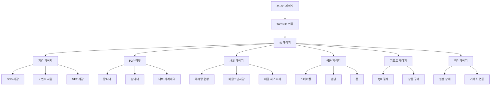

# IC Wallet 제품 요구사항 문서 (PRD)

## 1. Product Overview

i-Castle 회원을 위한 Web3 라이프스타일 지갑으로, MLM 활동으로 얻은 디지털 포인트를 실물 가치(상품권)와 현금성 자산(USDT)으로 쉽고 안전하게 교환할 수 있는 원스톱 솔루션을 제공합니다.

타겟 사용자는 암호화폐에 생소하지만 스마트폰 뱅킹에 익숙한 i-Castle 플래티넘 회원들로, 카카오톡처럼 쉽게 시작해서 은행 앱처럼 안전하게 자산을 관리할 수 있는 직관적인 지갑 서비스입니다.

**현재 구현 상태**: React 18 + TypeScript 기반 모바일 우선 웹 애플리케이션으로 구현되었으며, 모든 핵심 기능이 Mock 데이터로 동작하는 프로토타입 단계입니다.

## 2. Core Features

### 2.1 User Roles

| Role | Registration Method | Core Permissions |
|------|---------------------|------------------|
| i-Castle 회원 | i-Castle 계정 연동 | 모든 지갑 기능 이용 가능 |
| 관리자 | 관리자 초대 | 시스템 설정 및 사용자 관리 |

### 2.2 Feature Module

IC Wallet은 다음 주요 페이지들로 구성됩니다:

1. **로그인 페이지**: 소셜 로그인 (카카오, 구글, 애플), Turnstile 보안 인증, 자동 지갑 생성
2. **홈 페이지**: 총 자산 현황, 바로가기 버튼, 암호화폐 목록, 상품권 NFT 목록
3. **지갑 페이지**: BNB 지갑, 포인트 지갑(채굴코인), NFT 지갑 관리
4. **P2P 마켓**: 상품권 NFT/토큰/PIN 거래, USDT/ICF 통화, 검색 필터, 판매/구매 관리
5. **채굴 페이지**: 해시량 현황, Hashrate Trend, 24hr 통계, 8종 코인 채굴, 채굴코인지갑
6. **채굴 히스토리**: 채굴 내역 상세, 수익 통계, 출금 기록
7. **금융 페이지**: 스테이킹/랜딩/론 서비스, 조건별 상품, 현황 관리, 상환/해지
8. **기프트 페이지**: IC Gift NFT, 제휴 기프트카드, 일반 상품, QR 결제 생성, 상품권 사용 내역
9. **마이페이지**: 프로필 관리, 보안 설정, 거래소 계정 관리, 화이트리스트, 고객센터

### 2.3 Page Details

| Page Name | Module Name | Feature description |
|-----------|-------------|---------------------|
| 로그인 페이지 | 소셜 로그인 | 카카오, 구글, 애플 OAuth 연동, 자동 지갑 주소 생성 |
| 로그인 페이지 | Turnstile 보안 | 로그인, 회원가입, 비밀번호 찾기 시 Turnstile 인증 |
| 글로벌 레이아웃 | 상단 헤더 | 로고/뒤로가기, 사용자 프로필, 알림 아이콘 |
| 글로벌 레이아웃 | 하단 네비게이션 | 홈, P2P, 채굴, 금융, 기프트 탭 네비게이션 |
| 홈 페이지 | 총 자산 현황 | USDT 기준 전체 자산 합계 표시, 실시간 업데이트 |
| 홈 페이지 | 바로가기 버튼 | 송금, QR코드, 추가, 트렌딩, 채굴, 활동 바로가기 |
| 홈 페이지 | 암호화폐 목록 | ICC, ICS, ICG, ICF, AITC, AITCP, BNB, USDT 보유량과 24시간 변동률 표시 |
| 홈 페이지 | 상품권 NFT 목록 | 가로 스크롤 카드 형태, 스타벅스, CGV, 롯데 상품권 표시 |
| 지갑 페이지 | BNB 지갑 | BNB 네트워크 전송, 받기(QR코드), 거래내역 조회 |
| 지갑 페이지 | 포인트 지갑 | 채굴코인 관리, 잔액 조회, 적립 내역 |
| 지갑 페이지 | NFT 지갑 | 상품권 NFT 전송, 받기, 구매, 보유 현황 |
| P2P 마켓 | 거래 대상 | 상품권 NFT, 토큰(ICC, ICS), 상품권(PIN) 거래 |
| P2P 마켓 | 통화 시스템 | USDT, ICF 기반 거래 통화 |
| P2P 마켓 | 검색 필터 | 전체, 토큰, NFT, 쿠폰(PIN) 카테고리별 검색 |
| P2P 마켓 | 팝니다 기능 | 판매내역 조회, NFT/토큰 판매등록 |
| P2P 마켓 | 삽니다 기능 | 구매내역 조회, NFT/토큰 구매등록 |
| P2P 마켓 | 거래 관리 | 나의 거래내역, 거래 상태 추적, 평점 시스템 |
| 채굴 페이지 | 해시량 현황 | 나의 총 보유 해시량, 실시간 모니터링 |
| 채굴 페이지 | Hashrate Trend | 해시레이트 추세 그래프, 성능 분석 |
| 채굴 페이지 | 24hr 통계 | 24hr hashrate, Reject Rate, 24Hr Profit 표시 |
| 채굴 페이지 | 일일 수익 | 나의 어제 채굴량 USDT 환산가치 |
| 채굴 페이지 | 8종 코인 채굴 | LTC, DOGE, BELLS 등 8개 코인 채굴량 관리 |
| 채굴 페이지 | 채굴코인지갑 | 잔액 조회, 적립(채굴) 내역, 출금 기능 |
| 채굴 히스토리 | 채굴 내역 | 코인별 채굴 기록, 일별/월별 통계, 수익률 차트 |
| 금융 페이지 | 스테이킹 서비스 | 스테이킹 조건, 상품별 APY, 예치/해지 관리 |
| 금융 페이지 | 랜딩 서비스 | 랜딩 조건, 대출 상품, 이자율 관리 |
| 금융 페이지 | 론 서비스 | 론 조건, 담보 설정, 상환 계획 |
| 금융 페이지 | 현황 관리 | 나의 현재 스테이킹/랜딩/론 현황 |
| 금융 페이지 | 상환/해지 | 조기 상환, 계약 해지, 수수료 계산 |
| 기프트 페이지 | IC Gift NFT | 프리미엄 NFT 상품권, 한정판 컬렉션 |
| 기프트 페이지 | 제휴 기프트카드 | 스타벅스, CGV, 롯데 등 브랜드 상품권 |
| 기프트 페이지 | 일반 상품 | 생활용품, 전자제품 등 실물 상품 구매 |
| 기프트 페이지 | QR 결제 생성 | 잔액 차감형 결제, 1회용 시간제한 QR 코드, 가맹점 연동 |
| 마이페이지 | 프로필 관리 | 개인정보 수정, 프로필 이미지 업로드, 지갑 주소 관리 |
| 마이페이지 | 보안 설정 | 앱 잠금, 생체인증, 2FA, 화이트리스트 관리 |
| 마이페이지 | 거래소 연동 | CoinEx 계정 연결, API 키 관리, 출금 설정 |
| 마이페이지 | 고객센터 | FAQ, 1:1 문의, 공지사항, 업데이트 내역 |

## 3. Core Process

### 사용자 주요 플로우

**회원가입 및 로그인 플로우**: 사용자가 카카오/구글/애플 소셜 로그인을 통해 간편하게 가입하고, Turnstile 보안 인증을 거쳐 자동으로 BNB 네트워크 지갑 주소가 생성됩니다.

**자산 확인 플로우**: 사용자가 앱에 접속하여 홈 대시보드에서 전체 자산 현황을 USDT 기준으로 확인하고, 개별 토큰을 클릭하여 상세 정보와 24시간 변동률을 조회합니다.

**P2P 거래 플로우**: 사용자가 P2P 마켓에서 상품권 NFT, 토큰(ICC, ICS), 상품권(PIN) 거래를 USDT/ICF 통화로 진행하며, 검색 필터를 통해 원하는 상품을 찾고 판매/구매 등록을 통해 거래합니다.

**채굴 및 출금 플로우**: 사용자가 보유한 해시량으로 LTC, DOGE, BELLS 등 8종 코인을 채굴하며, Hashrate Trend와 24hr 통계를 모니터링하고, 채굴코인지갑에서 잔액을 확인하여 출금 신청을 진행합니다.

**금융 서비스 플로우**: 사용자가 스테이킹/랜딩/론 서비스의 조건을 확인하고 상품을 선택하여 예치하며, 현황 관리를 통해 수익을 모니터링하고 필요시 상환/해지를 진행합니다.

**상품권 구매 및 사용 플로우**: 사용자가 IC Gift NFT, 제휴 기프트카드, 일반 상품을 구매하고, 보유한 상품권에서 사용할 금액을 입력하여 QR 코드를 생성하여 가맹점에서 결제를 완료합니다.

## 4. User Interface Design

### 4.1 Design Style

- **Primary Color**: Blue (#3B82F6) - 신뢰와 안정성을 나타내는 메인 컬러
- **Secondary Color**: Gray (#6B7280) - 중성적이고 모던한 보조 컬러
- **Accent Colors**: Green (#10B981), Red (#EF4444), Yellow (#F59E0B)
- **Background**: White (#FFFFFF), Light Gray (#F9FAFB)
- **Text Colors**: Dark Gray (#111827), Medium Gray (#6B7280), Light Gray (#9CA3AF)
- **Button Style**: 둥근 모서리(rounded-lg) 버튼, 그림자 효과
- **Font**: 시스템 폰트 (Inter, system-ui, sans-serif)
- **Layout**: 카드 기반 레이아웃, 하단 고정 네비게이션, 모바일 우선 반응형
- **Icons**: Lucide React 아이콘 라이브러리 사용
- **Animation**: Tailwind CSS transition 클래스 활용한 부드러운 애니메이션

### 4.2 Page Design Overview

| Page Name | Module Name | UI Elements |
|-----------|-------------|-------------|
| 글로벌 헤더 | 로고/뒤로가기 | 왼쪽: IC Wallet 로고 또는 뒤로가기 + 페이지 제목 |
| 글로벌 헤더 | 사용자 프로필 | 오른쪽: 32px 원형 프로필 이미지 + 이름 + 알림 아이콘 |
| 하단 네비게이션 | 메뉴 탭 | 5개 탭(홈, P2P, 채굴, 금융, 기프트), 활성화 시 파란색 배경 |
| 로그인 페이지 | 소셜 로그인 버튼 | 카카오(노란색), 구글(흰색), 애플(검은색) 브랜드 컬러 |
| 홈 페이지 | 총 자산 카드 | 큰 USDT 금액 표시, 흰색 배경 + 그림자 효과 |
| 홈 페이지 | 바로가기 버튼 | 6개 원형 버튼, 아이콘 + 라벨, 그리드 레이아웃 |
| 홈 페이지 | 토큰 리스트 | 확장 가능한 카드, 코인 아이콘 + 잔액 + 변동률 |
| 홈 페이지 | 상품권 NFT | 가로 스크롤 카드, 브랜드별 디자인 |
| P2P 마켓 | 탭 네비게이션 | 팝니다/삽니다/내거래 탭, 언더라인 활성화 |
| P2P 마켓 | 주문 카드 | 사용자 정보, 토큰 정보, 가격, 거래 방식 표시 |
| 채굴 페이지 | 보물상자 애니메이션 | CSS 애니메이션, 일일 보상 시각화 |
| 채굴 페이지 | 코인 그리드 | 8종 코인 카드, 채굴량 + 가치 표시 |
| 금융 페이지 | 서비스 탭 | 스테이킹/NFT 대여/대출 탭 구조 |
| 기프트 페이지 | 상품 카테고리 | IC Gift NFT/제휴 기프트카드/일반 상품 탭 |
| 마이페이지 | 설정 메뉴 | 리스트 형태, 아이콘 + 제목 + 화살표 |

### 4.3 Responsiveness

모바일 우선(Mobile-First) 반응형 디자인으로 설계되며, 터치 인터랙션에 최적화된 UI/UX를 제공합니다. 최소 터치 영역 44px 이상 확보, 스와이프 제스처 지원, 가로/세로 화면 모두 지원합니다.

## 5. 기술 스택 및 구현 현황

### 5.1 Frontend 기술 스택

- **Framework**: React 18 + TypeScript + Vite
- **상태 관리**: Zustand (persist 미들웨어 포함)
- **데이터 페칭**: React Query (@tanstack/react-query)
- **스타일링**: Tailwind CSS + PostCSS
- **라우팅**: React Router DOM
- **아이콘**: Lucide React
- **Web3 연동**: ethers.js + MetaMask
- **빌드 도구**: Vite + TypeScript

### 5.2 Backend 기술 스택

- **Runtime**: Node.js + Express.js
- **개발 도구**: Nodemon + Concurrently
- **API**: RESTful API (인증 라우트 샘플)
- **배포**: Vercel (프론트엔드 + API 라우트)

### 5.3 블록체인 연동

- **네트워크**: BNB Chain (Binance Smart Chain)
- **지갑 연동**: MetaMask, 자체 지갑
- **BNB API**: BNB 관련 API 연동 (전송, 받기, 거래내역)
- **스마트 컨트랙트**: 에스크로 컨트랙트, NFT 컨트랙트
- **Web3 라이브러리**: ethers.js

### 5.4 현재 구현 상태

#### ✅ 완료된 기능
- 모든 UI 컴포넌트 및 페이지 구현
- 소셜 로그인 (카카오, 구글, 애플) UI
- 홈 대시보드 (자산 현황, 토큰 목록, 상품권 NFT)
- P2P 마켓 (거래 게시판, 주문 관리)
- 채굴 페이지 (8종 코인, HASH 파워, 출금)
- 금융 서비스 (스테이킹, NFT 대여, 대출)
- 기프트 스토어 (3개 카테고리, QR 결제)
- 마이페이지 (프로필, 보안, 설정)
- 반응형 모바일 디자인
- Zustand 기반 상태 관리
- Mock 데이터로 동작하는 프로토타입

#### 🚧 개발 중인 기능
- Express.js 백엔드 API 구현
- 실제 데이터베이스 연동
- 소셜 로그인 OAuth 구현
- 블록체인 스마트 컨트랙트 배포
- CoinEx API 연동

#### 📋 향후 개발 계획
1. **Phase 1**: 백엔드 API 완성 및 데이터베이스 연동
2. **Phase 2**: 소셜 로그인 및 Turnstile 보안 시스템 구현
3. **Phase 3**: BNB API 연동 및 지갑 기능 구현
4. **Phase 4**: P2P 마켓 상세 기능 및 검색 필터 구현
5. **Phase 5**: 채굴 시스템 고도화 및 실시간 모니터링
6. **Phase 6**: 금융 서비스 (스테이킹/랜딩/론) 구현
7. **Phase 7**: 보안 강화 및 성능 최적화
8. **Phase 8**: 프로덕션 배포 및 모니터링

### 5.5 개발 환경

- **개발 서버**: `npm run dev` (프론트엔드 + 백엔드 동시 실행)
- **프론트엔드**: `npm run client:dev` (포트 5173)
- **백엔드**: `npm run server:dev` (Express 서버)
- **빌드**: `npm run build` (TypeScript + Vite 프로덕션 빌드)
- **배포**: Vercel (자동 배포 설정 완료)

## 6. 개발 작업 순서 및 우선순위

### 6.1 Phase 1: 기반 시스템 구축 (1-2주)

#### 🔐 보안 시스템
- **Turnstile 보안 인증 구현**
  - 로그인, 회원가입, 비밀번호 찾기 페이지에 Turnstile 적용
  - 별도 제공 파일을 활용한 보안 설정
  - 프론트엔드 컴포넌트 및 백엔드 검증 로직 구현

#### 🔑 소셜 로그인 시스템
- **OAuth 연동 구현**
  - 카카오, 구글, 애플 소셜 로그인 API 연동
  - JWT 토큰 기반 인증 시스템 구축
  - 사용자 정보 동기화 및 지갑 주소 자동 생성

#### 🗄️ 백엔드 API 기반 구축
- **Express.js 서버 완성**
  - 인증 라우트 완성 및 미들웨어 구현
  - 데이터베이스 스키마 설계 및 연결
  - API 응답 표준화 및 에러 핸들링

### 6.2 Phase 2: 지갑 시스템 구현 (2-3주)

#### 💰 BNB 지갑 기능
- **BNB API 연동**
  - BNB 네트워크 전송 기능 구현
  - QR코드 기반 받기 기능 구현
  - 거래내역 조회 및 표시 기능
  - 잔액 실시간 업데이트

#### 🎯 포인트 지갑 (채굴코인)
- **채굴코인 관리 시스템**
  - 8종 코인 (LTC, DOGE, BELLS 등) 지갑 구현
  - 잔액 조회 및 적립 내역 관리
  - 채굴 보상 자동 적립 시스템

#### 🎨 NFT 지갑
- **상품권 NFT 관리**
  - NFT 전송, 받기 기능 구현
  - 상품권 NFT 구매 시스템
  - NFT 보유 현황 및 메타데이터 표시

### 6.3 Phase 3: P2P 마켓 고도화 (2-3주)

#### 🛒 거래 시스템 상세화
- **거래 대상 확장**
  - 상품권 NFT, 토큰(ICC, ICS), 상품권(PIN) 거래 지원
  - USDT, ICF 기반 통화 시스템 구현
  - 다중 결제 수단 지원

#### 🔍 검색 및 필터링
- **고급 검색 기능**
  - 전체, 토큰, NFT, 쿠폰(PIN) 카테고리별 검색
  - 가격 범위, 거래량, 평점 기반 필터링
  - 실시간 검색 결과 업데이트

#### 📊 거래 관리 시스템
- **판매/구매 관리**
  - 팝니다: 판매내역 조회, NFT/토큰 판매등록
  - 삽니다: 구매내역 조회, NFT/토큰 구매등록
  - 나의 거래내역 통합 관리
  - 거래 상태 추적 및 알림 시스템

### 6.4 Phase 4: 채굴 시스템 고도화 (2-3주)

#### ⛏️ 채굴 모니터링 시스템
- **실시간 해시량 관리**
  - 나의 총 보유 해시량 실시간 모니터링
  - Hashrate Trend 그래프 및 성능 분석
  - 24hr hashrate, Reject Rate, 24Hr Profit 통계

#### 💎 채굴 수익 관리
- **수익 계산 및 표시**
  - 나의 어제 채굴량 USDT 환산가치 계산
  - 8종 코인별 채굴량 상세 관리
  - 채굴 효율성 분석 및 최적화 제안

#### 🏦 채굴코인지갑 고도화
- **지갑 기능 확장**
  - 잔액 조회 및 실시간 업데이트
  - 적립(채굴) 내역 상세 기록
  - 출금 기능 및 수수료 계산

### 6.5 Phase 5: 금융 서비스 구현 (3-4주)

#### 💰 스테이킹 서비스
- **스테이킹 상품 관리**
  - 스테이킹 조건 및 APY 설정
  - 상품별 최소/최대 예치 금액 관리
  - 예치/해지 프로세스 구현

#### 🏛️ 랜딩 서비스
- **대출 상품 시스템**
  - 랜딩 조건 및 이자율 관리
  - 대출 신청 및 승인 프로세스
  - 리스크 평가 및 담보 관리

#### 💳 론 서비스
- **대출 관리 시스템**
  - 론 조건 및 담보 설정
  - 상환 계획 및 일정 관리
  - 연체 관리 및 청산 프로세스

#### 📈 현황 관리
- **통합 대시보드**
  - 나의 현재 스테이킹/랜딩/론 현황
  - 수익률 및 손익 계산
  - 조기 상환, 계약 해지, 수수료 계산

### 6.6 Phase 6: UI/UX 개선 및 최적화 (1-2주)

#### 🎨 디자인 시스템 완성
- **로고 및 아이콘 적용**
  - IC Wallet 브랜드 로고 디자인 및 적용
  - 일관된 아이콘 시스템 구축
  - 브랜드 가이드라인 수립

#### 📱 반응형 최적화
- **모바일 우선 디자인**
  - 터치 인터랙션 최적화
  - 다양한 화면 크기 대응
  - 성능 최적화 및 로딩 속도 개선

### 6.7 Phase 7: 보안 강화 및 테스트 (1-2주)

#### 🔒 보안 시스템 강화
- **다층 보안 구현**
  - 2FA 인증 시스템
  - 화이트리스트 관리
  - 거래 한도 및 이상 거래 탐지

#### 🧪 테스트 및 QA
- **종합 테스트**
  - 단위 테스트 및 통합 테스트
  - 보안 취약점 점검
  - 사용자 시나리오 테스트

### 6.8 Phase 8: 프로덕션 배포 (1주)

#### 🚀 배포 및 모니터링
- **프로덕션 환경 구축**
  - 서버 인프라 구성
  - CI/CD 파이프라인 구축
  - 모니터링 및 로깅 시스템
  - 백업 및 재해 복구 계획

### 6.9 개발 우선순위 요약

| 우선순위 | 기능 | 예상 기간 | 중요도 |
|---------|------|----------|--------|
| 1 | Turnstile 보안 + 소셜 로그인 | 1-2주 | 🔴 Critical |
| 2 | BNB 지갑 기능 | 2-3주 | 🔴 Critical |
| 3 | P2P 마켓 상세화 | 2-3주 | 🟡 High |
| 4 | 채굴 시스템 고도화 | 2-3주 | 🟡 High |
| 5 | 금융 서비스 구현 | 3-4주 | 🟡 High |
| 6 | UI/UX 최적화 | 1-2주 | 🟢 Medium |
| 7 | 보안 강화 및 테스트 | 1-2주 | 🔴 Critical |
| 8 | 프로덕션 배포 | 1주 | 🔴 Critical |

**총 예상 개발 기간: 13-20주 (약 3-5개월)**