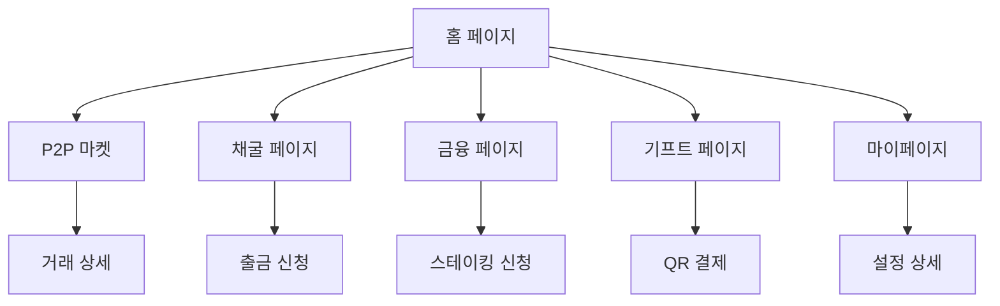

# IC Wallet 제품 요구사항 문서 (PRD)

## 1. Product Overview

i-Castle 회원을 위한 Web3 라이프스타일 지갑으로, MLM 활동으로 얻은 디지털 포인트를 실물 가치(상품권)와 현금성 자산(USDT)으로 쉽고 안전하게 교환할 수 있는 원스톱 솔루션을 제공합니다.

타겟 사용자는 암호화폐에 생소하지만 스마트폰 뱅킹에 익숙한 i-Castle 플래티넘 회원들로, 카카오톡처럼 쉽게 시작해서 은행 앱처럼 안전하게 자산을 관리할 수 있는 직관적인 지갑 서비스입니다.

## 2. Core Features

### 2.1 User Roles

| Role | Registration Method | Core Permissions |
|------|---------------------|------------------|
| i-Castle 회원 | i-Castle 계정 연동 | 모든 지갑 기능 이용 가능 |
| 관리자 | 관리자 초대 | 시스템 설정 및 사용자 관리 |

### 2.2 Feature Module

IC Wallet은 다음 주요 페이지들로 구성됩니다:

1. **홈 페이지**: 총 자산 현황, 바로가기 버튼, 암호화폐 목록, 상품권 NFT 목록
2. **P2P 마켓**: 토큰 거래 게시판, 판매/구매 탭, 내 거래 관리
3. **채굴 페이지**: 채굴 대시보드, HASH 파워 현황, 8종 코인 채굴 내역, 출금 관리
4. **금융 페이지**: USDT/상품권 스테이킹, 예치 내역, 리워드 현황
5. **기프트 페이지**: 상품권 스토어, QR 결제 생성, 상품권 사용 내역
6. **마이페이지**: 계정 설정, 보안 설정, 거래소 계정 관리

### 2.3 Page Details

| Page Name | Module Name | Feature description |
|-----------|-------------|---------------------|
| 홈 페이지 | 총 자산 현황 | USDT 기준 전체 자산 합계 표시, H1 스타일 강조 |
| 홈 페이지 | 바로가기 버튼 | 상품권 토큰 교환, P2P 거래, 상품권 구매 버튼 |
| 홈 페이지 | 암호화폐 목록 | ICC, ICS, ICG, USDT 보유량과 가치 표시, 상세 내역 이동 |
| 홈 페이지 | 상품권 NFT 목록 | 가로 스크롤 카드 형태, 권종별 상품권 표시 |
| P2P 마켓 | 거래 게시판 | 팝니다/삽니다/내거래 탭, 고정가격 거래 시스템 |
| P2P 마켓 | 게시글 관리 | 내 게시글 수정/삭제, 거래 진행 중 상태 관리 |
| 채굴 페이지 | 채굴 대시보드 | 보물상자 그래픽, 일일 보상 애니메이션 효과 |
| 채굴 페이지 | HASH 파워 현황 | 총 HASH 파워, 오늘 채굴 보상 USDT 가치 표시 |
| 채굴 페이지 | 출금 관리 | CoinEx 연동 출금, 상태 추적, 푸시 알림 |
| 금융 페이지 | 스테이킹 상품 | USDT/상품권 예치 상품, APY 표시 |
| 금융 페이지 | 예치 내역 | 현재 스테이킹 상품 목록, 리워드 현황 |
| 기프트 페이지 | 상품권 스토어 | 고급스러운 지폐 디자인, 권종별 구매 |
| 기프트 페이지 | QR 결제 생성 | 잔액 차감형 결제, 1회용 시간제한 QR 코드 |
| 마이페이지 | 계정 설정 | 프로필 정보, 지갑 주소 복사 |
| 마이페이지 | 보안 설정 | 앱 잠금, 알림 설정, 화이트리스트 관리 |

## 3. Core Process

### 사용자 주요 플로우

**자산 확인 플로우**: 사용자가 앱에 접속하여 홈 대시보드에서 전체 자산 현황을 확인하고, 개별 토큰을 클릭하여 상세 거래 내역을 조회합니다.

**P2P 거래 플로우**: 사용자가 P2P 마켓에서 원하는 토큰의 판매/구매 게시글을 확인하고, 스마트 컨트랙트 기반 에스크로를 통해 안전하게 거래를 진행합니다.

**채굴 및 출금 플로우**: 사용자가 HASH 파워로 8종 코인을 채굴하고, 일정 수량이 모이면 CoinEx 거래소로 출금 신청을 하여 현금화합니다.

**상품권 사용 플로우**: 사용자가 보유한 상품권 NFT에서 사용할 금액을 입력하고 QR 코드를 생성하여, 가맹점에서 스캔하여 결제를 완료합니다.

## 4. User Interface Design

### 4.1 Design Style

- **Primary Color**: Prestige Blue (#1A2A6C) - 신뢰와 품격을 나타내는 메인 컬러
- **Secondary Color**: Royal Gold (#D4AF37) - 프리미엄 느낌의 보조 컬러
- **Accent Colors**: Vital Green (#28A745), Warning Red (#DC3545)
- **Background**: White (#FFFFFF) - 깔끔하고 모던한 배경
- **Text Colors**: Main (#212529), Secondary (#6C757D)
- **Button Style**: 현대적인 알약(Pill) 형태의 둥근 버튼
- **Font**: Pretendard 폰트 시스템 (H1: 28px Bold, H2: 22px SemiBold, Body: 16px/14px)
- **Layout**: 카드 기반 레이아웃, 하단 고정 네비게이션
- **Icons**: Solid/Outline 형태의 직관적인 아이콘

### 4.2 Page Design Overview

| Page Name | Module Name | UI Elements |
|-----------|-------------|-------------|
| 글로벌 헤더 | 로고/뒤로가기 | 왼쪽: IC Wallet 심볼 로고 또는 뒤로가기 + 제목 |
| 글로벌 헤더 | 사용자 프로필 | 오른쪽: 32px 원형 프로필 이미지 + 이름 + 설정 아이콘 |
| 하단 네비게이션 | 메뉴 탭 | 알약 형태 활성화 스타일, Prestige Blue 배경 + 흰색 텍스트 |
| 홈 페이지 | 총 자산 카드 | H1 스타일 USDT 금액, Surface 배경 + 그림자 효과 |
| 홈 페이지 | 암호화폐 리스트 | 카드 형태, 아이콘 + 이름 + 수량 + 가치 표시 |
| P2P 마켓 | 게시글 카드 | 판매/구매 태그, 코인 정보, 가격 정보 표시 |
| 채굴 페이지 | 시각화 영역 | 보물상자 그래픽, 일일 보상 애니메이션 |
| 기프트 페이지 | 상품권 카드 | 고급스러운 지폐 디자인, 권종 표시 |

### 4.3 Responsiveness

모바일 우선(Mobile-First) 반응형 디자인으로 설계되며, 터치 인터랙션에 최적화된 UI/UX를 제공합니다. 최소 터치 영역 44px 이상 확보, 스와이프 제스처 지원, 가로/세로 화면 모두 지원합니다.