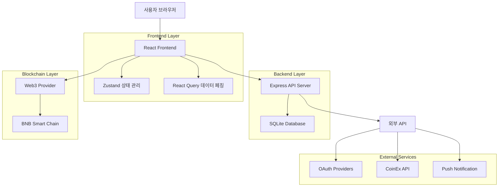
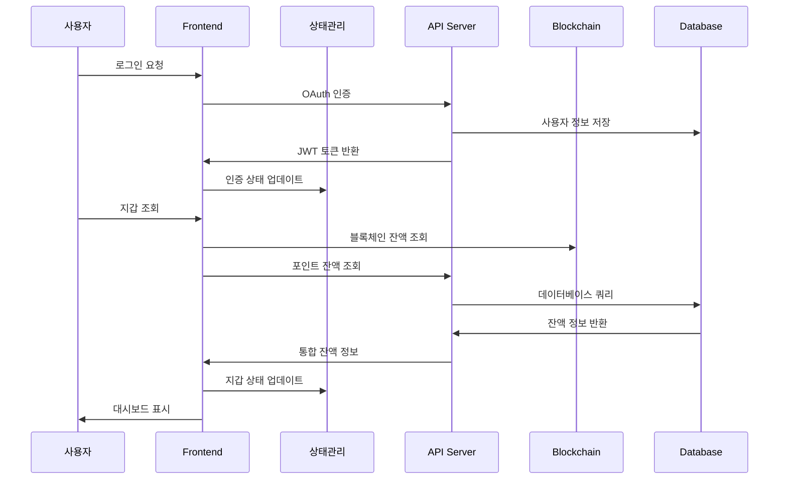
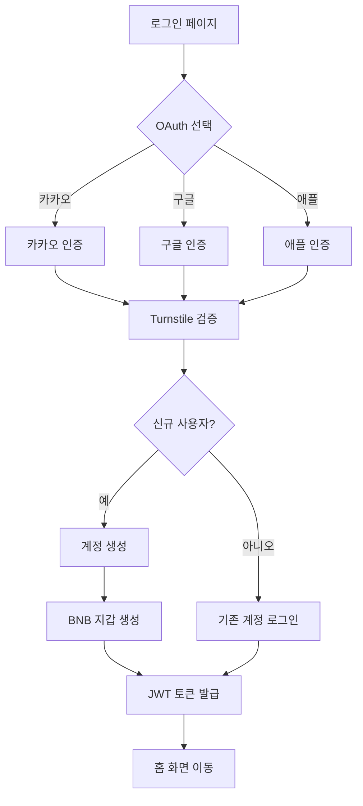
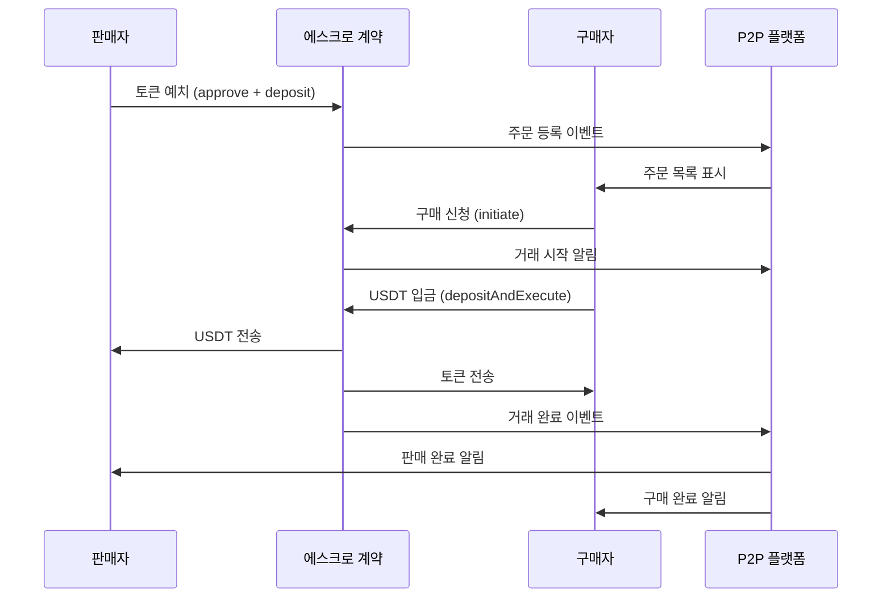
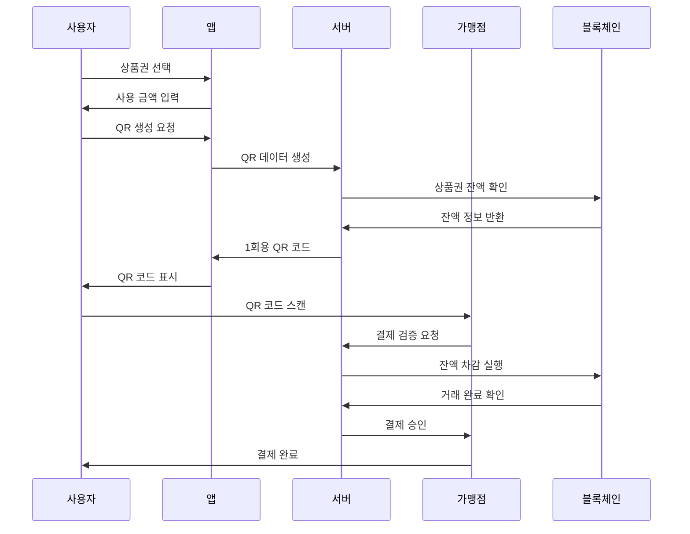

# IC Wallet 제품 요구사항 문서 (PRD) v2.0

## 1. 문서 개요

| 항목 | 내용 |
|------|------|
| **문서 버전** | v2.0 |
| **최종 수정일** | 2024년 12월 19일 |
| **작성자** | IC Wallet 개발팀 |
| **검토자** | 제품 관리팀 |
| **문서 목적** | IC Wallet 웹 애플리케이션의 상세 기능 요구사항 및 기술 사양 정의 |
| **대상 독자** | 개발팀, QA팀, 제품 관리팀, 이해관계자 |

### 1.1 문서 변경 이력

| 버전 | 날짜 | 변경 내용 | 작성자 |
|------|------|-----------|--------|
| v1.0 | 2024년 11월 | 초기 PRD 작성 | 개발팀 |
| v2.0 | 2024년 12월 19일 | 구현 완료 기능 반영, 상세 기술 사양 추가 | 개발팀 |

## 2. 프로젝트 개요

### 2.1 프로젝트 명
**IC Wallet** - i-Castle 통합 디지털 자산 관리 플랫폼

### 2.2 프로젝트 목적
i-Castle 회원을 위한 Web3 라이프스타일 지갑으로, MLM 활동으로 얻은 디지털 포인트를 실물 가치(상품권)와 현금성 자산(USDT)으로 쉽고 안전하게 교환할 수 있는 원스톱 솔루션을 제공합니다.

**핵심 가치 제안:**
- 암호화폐에 생소한 사용자도 쉽게 사용할 수 있는 직관적인 UI/UX
- 카카오톡처럼 쉽게 시작해서 은행 앱처럼 안전하게 자산을 관리
- 디지털 자산과 실물 경제의 연결고리 역할
- P2P 거래를 통한 유동성 확보 및 가치 실현

### 2.3 프로젝트 범위

#### 2.3.1 포함 항목
- **사용자 인증**: 소셜 로그인 (카카오, 구글, 애플) 및 보안 인증
- **지갑 관리**: BNB, 포인트, NFT 지갑 통합 관리
- **P2P 거래**: 토큰 및 NFT 상품권 거래 플랫폼
- **채굴 시스템**: 8종 코인 채굴 및 수익 관리
- **금융 서비스**: 스테이킹, 대출, NFT 대여 서비스
- **기프트 스토어**: 상품권 구매 및 QR 결제 시스템
- **사용자 설정**: 프로필, 보안, 알림 관리
- **모바일 최적화**: 반응형 웹 애플리케이션

#### 2.3.2 제외 항목
- 네이티브 모바일 앱 (iOS/Android)
- 실시간 채팅 시스템
- 고급 차트 분석 도구
- 다중 블록체인 지원 (BNB Chain 외)
- 법정화폐 직접 입출금

### 2.4 타겟 사용자
- **주요 사용자**: i-Castle 플래티넘 회원
- **사용자 특성**: 암호화폐에 생소하지만 스마트폰 뱅킹에 익숙
- **연령대**: 30-60세
- **기술 수준**: 중급 (스마트폰 앱 사용 가능)

## 3. 요구사항 사양

### 3.1 기능 요구사항

#### 3.1.1 사용자 인증 및 계정 관리

| 기능명 | 소셜 로그인 시스템 |
|--------|-------------------|
| **설명** | 카카오, 구글, 애플 OAuth를 통한 간편 로그인 |
| **우선순위** | 높음 (P0) |
| **입력 사양** | OAuth 토큰, 사용자 동의 |
| **출력 사양** | JWT 토큰, 사용자 정보, 자동 생성된 지갑 주소 |
| **비즈니스 규칙** | - 최초 로그인 시 BNB 지갑 자동 생성<br>- Turnstile 보안 인증 필수 |
| **예외 처리** | OAuth 실패 시 에러 메시지 표시, 재시도 옵션 제공 |

| 기능명 | 프로필 관리 |
|--------|-------------|
| **설명** | 사용자 개인정보 수정 및 프로필 이미지 업로드 |
| **우선순위** | 중간 (P1) |
| **입력 사양** | 이름, 이메일, 프로필 이미지 파일 |
| **출력 사양** | 업데이트된 사용자 정보 |
| **비즈니스 규칙** | - 이메일 중복 검증<br>- 이미지 파일 크기 제한 (5MB) |
| **예외 처리** | 유효성 검증 실패 시 상세 오류 메시지 |

#### 3.1.2 지갑 관리 시스템

| 기능명 | 통합 지갑 대시보드 |
|--------|-------------------|
| **설명** | BNB, 포인트, NFT 지갑의 통합 자산 현황 표시 |
| **우선순위** | 높음 (P0) |
| **입력 사양** | 사용자 인증 토큰 |
| **출력 사양** | 총 자산 가치(USDT), 개별 토큰 잔액, 24시간 변동률 |
| **비즈니스 규칙** | - 실시간 가격 업데이트<br>- USDT 기준 가치 환산 |
| **예외 처리** | 네트워크 오류 시 캐시된 데이터 표시 |

| 기능명 | QR 코드 생성 및 주소 관리 |
|--------|---------------------------|
| **설명** | 토큰 받기용 QR 코드 생성 및 주소 복사/공유 |
| **우선순위** | 높음 (P0) |
| **입력 사양** | 토큰 타입, 수량 (선택사항) |
| **출력 사양** | QR 코드 이미지, 지갑 주소 |
| **비즈니스 규칙** | - 토큰별 고유 주소 생성<br>- QR 코드 다운로드 지원 |
| **예외 처리** | QR 생성 실패 시 주소 텍스트로 대체 |

#### 3.1.3 P2P 거래 플랫폼

| 기능명 | P2P 주문 관리 시스템 |
|--------|---------------------|
| **설명** | 토큰 및 NFT 상품권의 판매/구매 주문 등록 및 관리 |
| **우선순위** | 높음 (P0) |
| **입력 사양** | 거래 대상(토큰/NFT), 수량, 가격, 거래 방식 |
| **출력 사양** | 주문 ID, 거래 상태, 매칭 결과 |
| **비즈니스 규칙** | - USDT/ICF 기준 가격 설정<br>- 에스크로 시스템 적용<br>- 평점 시스템 연동 |
| **예외 처리** | 잔액 부족, 주문 취소, 거래 분쟁 처리 |

| 기능명 | 거래 검색 및 필터링 |
|--------|---------------------|
| **설명** | 카테고리별 거래 검색 및 정렬 기능 |
| **우선순위** | 중간 (P1) |
| **입력 사양** | 검색어, 카테고리(토큰/NFT/쿠폰), 정렬 기준 |
| **출력 사양** | 필터링된 거래 목록 |
| **비즈니스 규칙** | - 실시간 검색 결과 업데이트<br>- 가격순/시간순 정렬 |
| **예외 처리** | 검색 결과 없음 시 추천 거래 표시 |

#### 3.1.4 채굴 시스템

| 기능명 | 멀티 코인 채굴 관리 |
|--------|---------------------|
| **설명** | LTC, DOGE, BELLS 등 8종 코인 채굴 현황 및 수익 관리 |
| **우선순위** | 높음 (P0) |
| **입력 사양** | 해시레이트, 채굴 풀 설정 |
| **출력 사양** | 일일 채굴량, 수익률, 해시레이트 트렌드 |
| **비즈니스 규칙** | - 24시간 통계 제공<br>- USDT 환산 수익 계산 |
| **예외 처리** | 채굴 풀 연결 실패 시 대체 풀 자동 연결 |

| 기능명 | 채굴 수익 출금 시스템 |
|--------|----------------------|
| **설명** | 채굴된 코인의 외부 지갑 출금 기능 |
| **우선순위** | 높음 (P0) |
| **입력 사양** | 출금 주소, 출금 수량, 2FA 인증 |
| **출력 사양** | 출금 요청 ID, 처리 상태 |
| **비즈니스 규칙** | - 최소 출금 수량 제한<br>- 일일 출금 한도 적용 |
| **예외 처리** | 주소 검증 실패, 잔액 부족 처리 |

#### 3.1.5 금융 서비스

| 기능명 | 스테이킹 서비스 |
|--------|----------------|
| **설명** | USDT 및 토큰 스테이킹을 통한 수익 창출 |
| **우선순위** | 중간 (P1) |
| **입력 사양** | 스테이킹 토큰, 수량, 기간 |
| **출력 사양** | 예상 수익률(APY), 스테이킹 상태 |
| **비즈니스 규칙** | - 최소 스테이킹 수량 제한<br>- 조기 해지 수수료 적용 |
| **예외 처리** | 스테이킹 풀 만료, 긴급 해지 처리 |

| 기능명 | NFT 대여 시스템 |
|--------|----------------|
| **설명** | 보유 NFT를 대여하여 수익 창출 |
| **우선순위** | 낮음 (P2) |
| **입력 사양** | NFT ID, 대여 기간, 대여료 |
| **출력 사양** | 대여 계약 ID, 수익 정산 |
| **비즈니스 규칙** | - 대여 기간 중 NFT 이전 제한<br>- 자동 반환 시스템 |
| **예외 처리** | 대여자 연체, NFT 손상 처리 |

#### 3.1.6 기프트 스토어

| 기능명 | 상품권 구매 시스템 |
|--------|-------------------|
| **설명** | IC Gift NFT, 제휴 기프트카드, 일반 상품 구매 |
| **우선순위** | 높음 (P0) |
| **입력 사양** | 상품 ID, 수량, 결제 수단 |
| **출력 사양** | 구매 확인서, NFT/상품권 코드 |
| **비즈니스 규칙** | - USDT/ICF/IC NFT 결제 지원<br>- 재고 실시간 관리 |
| **예외 처리** | 재고 부족, 결제 실패 처리 |

| 기능명 | QR 결제 생성 |
|--------|--------------|
| **설명** | 보유 상품권으로 가맹점 결제용 QR 코드 생성 |
| **우선순위** | 높음 (P0) |
| **입력 사양** | 상품권 ID, 사용 금액 |
| **출력 사양** | 1회용 QR 코드, 유효 시간 |
| **비즈니스 규칙** | - 시간 제한 QR 코드<br>- 잔액 차감형 결제 |
| **예외 처리** | QR 만료, 잔액 부족 처리 |

### 3.2 비기능 요구사항

#### 3.2.1 성능 요구사항
- **페이지 로딩 시간**: 초기 로딩 3초 이내, 페이지 전환 1초 이내
- **동시 사용자**: 최대 1,000명 동시 접속 지원
- **API 응답 시간**: 평균 500ms 이내
- **데이터베이스 쿼리**: 복잡한 쿼리 2초 이내 응답

#### 3.2.2 보안 요구사항
- **인증**: JWT 토큰 기반 인증, 토큰 만료 시간 24시간
- **데이터 암호화**: HTTPS 통신, 민감 데이터 AES-256 암호화
- **접근 제어**: 역할 기반 접근 제어 (RBAC)
- **보안 인증**: Turnstile CAPTCHA 적용
- **지갑 보안**: 개인키 클라이언트 측 암호화 저장

#### 3.2.3 호환성 요구사항
- **브라우저**: Chrome 90+, Safari 14+, Firefox 88+, Edge 90+
- **모바일**: iOS 14+, Android 8+ 웹 브라우저
- **화면 해상도**: 320px ~ 1920px 반응형 지원
- **네트워크**: 3G 이상 네트워크 환경

#### 3.2.4 가용성 요구사항
- **서비스 가용성**: 99.5% 이상
- **백업**: 일일 자동 백업, 실시간 데이터 복제
- **장애 복구**: 평균 복구 시간 4시간 이내
- **모니터링**: 실시간 시스템 모니터링 및 알림

## 4. 시스템 아키텍처

### 4.1 전체 시스템 다이어그램



### 4.2 기술 스택 상세 설명

#### 4.2.1 Frontend 기술 스택
- **React 18**: 함수형 컴포넌트, Hooks, Concurrent Features
- **TypeScript 5**: 정적 타입 검사, 개발 생산성 향상
- **Vite 5**: 빠른 개발 서버, HMR, 최적화된 빌드
- **Zustand**: 경량 상태 관리, Persist 미들웨어
- **React Query**: 서버 상태 관리, 캐싱, 동기화
- **Tailwind CSS 3**: 유틸리티 퍼스트 CSS 프레임워크
- **Headless UI**: 접근성 준수 UI 컴포넌트
- **Radix UI**: 고급 UI 프리미티브
- **Framer Motion**: 애니메이션 라이브러리
- **Lucide React**: 아이콘 라이브러리

#### 4.2.2 Backend 기술 스택
- **Node.js**: JavaScript 런타임
- **Express.js**: 웹 애플리케이션 프레임워크
- **TypeScript**: 백엔드 타입 안정성
- **SQLite**: 경량 관계형 데이터베이스
- **JWT**: JSON Web Token 인증
- **bcryptjs**: 비밀번호 해싱
- **Passport.js**: 인증 미들웨어
- **CORS**: Cross-Origin Resource Sharing

#### 4.2.3 Web3 기술 스택
- **ethers.js 6**: 이더리움 상호작용 라이브러리
- **wagmi 2**: React Hooks for Ethereum
- **BNB Smart Chain**: 메인 블록체인 네트워크
- **MetaMask**: 지갑 연동
- **Smart Contracts**: Solidity 기반 에스크로 계약

### 4.3 데이터 흐름도



## 5. 상세 기능 설명

### 5.1 사용자 인증 시스템

#### 5.1.1 사용 시나리오
1. **신규 사용자 가입**
   - 사용자가 카카오/구글/애플 로그인 버튼 클릭
   - OAuth 인증 페이지로 리다이렉트
   - 사용자 동의 후 인증 코드 반환
   - 서버에서 사용자 정보 생성 및 BNB 지갑 자동 생성
   - JWT 토큰 발급 및 홈 화면으로 이동

2. **기존 사용자 로그인**
   - OAuth 인증 후 기존 계정 확인
   - JWT 토큰 갱신
   - 마지막 접속 정보 업데이트

#### 5.1.2 프로세스 플로우



#### 5.1.3 API 명세

**POST /api/auth/oauth/callback**
```typescript
interface OAuthCallbackRequest {
  provider: 'kakao' | 'google' | 'apple';
  code: string;
  state?: string;
  turnstile_token: string;
}

interface OAuthCallbackResponse {
  access_token: string;
  refresh_token: string;
  user: {
    id: string;
    email: string;
    name: string;
    profile_image?: string;
    wallet_address: string;
  };
  is_new_user: boolean;
}
```

#### 5.1.4 데이터 모델

```sql
-- 사용자 테이블
CREATE TABLE users (
    id UUID PRIMARY KEY DEFAULT gen_random_uuid(),
    email VARCHAR(255) UNIQUE NOT NULL,
    name VARCHAR(100) NOT NULL,
    profile_image TEXT,
    provider VARCHAR(20) NOT NULL,
    provider_id VARCHAR(100) NOT NULL,
    wallet_address VARCHAR(42) NOT NULL,
    created_at TIMESTAMP WITH TIME ZONE DEFAULT NOW(),
    updated_at TIMESTAMP WITH TIME ZONE DEFAULT NOW()
);

-- 인덱스 생성
CREATE INDEX idx_users_email ON users(email);
CREATE INDEX idx_users_provider ON users(provider, provider_id);
CREATE INDEX idx_users_wallet_address ON users(wallet_address);
```

### 5.2 P2P 거래 시스템

#### 5.2.1 사용 시나리오
1. **판매 주문 등록**
   - 사용자가 보유 토큰/NFT 선택
   - 판매 수량 및 가격 설정
   - 거래 방식 선택 (즉시 거래/협상)
   - 에스크로 계약에 자산 예치
   - 주문 게시판에 등록

2. **구매 주문 실행**
   - 구매자가 원하는 주문 선택
   - 구매 수량 및 결제 수단 확인
   - 에스크로 계약 실행
   - 자동 자산 교환 완료

#### 5.2.2 프로세스 플로우



#### 5.2.3 스마트 계약 구조

```solidity
contract P2PEscrow {
    struct Trade {
        uint256 id;
        address seller;
        address buyer;
        address tokenAddress;
        uint256 amount;
        uint256 pricePerToken;
        uint256 expirationTime;
        TradeStatus status;
    }
    
    enum TradeStatus { Listed, Pending, Completed, Canceled }
    
    mapping(uint256 => Trade) public trades;
    uint256 public tradeCounter;
    
    function listAsset(
        address tokenAddress,
        uint256 amount,
        uint256 pricePerToken
    ) external returns (uint256 tradeId);
    
    function initiateTrade(uint256 tradeId) external;
    
    function depositAndExecute(uint256 tradeId) external;
    
    function reclaimAsset(uint256 tradeId) external;
}
```

### 5.3 채굴 시스템

#### 5.3.1 사용 시나리오
1. **채굴 현황 모니터링**
   - 사용자가 채굴 페이지 접속
   - 8종 코인별 채굴량 및 수익 확인
   - 해시레이트 트렌드 그래프 조회
   - 24시간 통계 및 수익률 분석

2. **채굴 수익 출금**
   - 채굴코인지갑에서 잔액 확인
   - 출금할 코인 및 수량 선택
   - 외부 지갑 주소 입력
   - 2FA 인증 후 출금 신청

#### 5.3.2 데이터 모델

```sql
-- 채굴 기록 테이블
CREATE TABLE mining_records (
    id UUID PRIMARY KEY DEFAULT gen_random_uuid(),
    user_id UUID REFERENCES users(id),
    coin_symbol VARCHAR(10) NOT NULL,
    amount DECIMAL(18, 8) NOT NULL,
    hash_rate DECIMAL(18, 8) NOT NULL,
    reward_usdt DECIMAL(18, 8) NOT NULL,
    mined_at TIMESTAMP WITH TIME ZONE DEFAULT NOW()
);

-- 출금 요청 테이블
CREATE TABLE withdrawal_requests (
    id UUID PRIMARY KEY DEFAULT gen_random_uuid(),
    user_id UUID REFERENCES users(id),
    coin_symbol VARCHAR(10) NOT NULL,
    amount DECIMAL(18, 8) NOT NULL,
    to_address VARCHAR(100) NOT NULL,
    status VARCHAR(20) DEFAULT 'pending',
    tx_hash VARCHAR(100),
    created_at TIMESTAMP WITH TIME ZONE DEFAULT NOW(),
    processed_at TIMESTAMP WITH TIME ZONE
);
```

### 5.4 기프트 스토어 시스템

#### 5.4.1 QR 결제 프로세스



## 6. 테스트 계획

### 6.1 테스트 전략
- **단위 테스트**: 개별 함수 및 컴포넌트 테스트
- **통합 테스트**: API 엔드포인트 및 데이터베이스 연동 테스트
- **E2E 테스트**: 사용자 시나리오 기반 전체 플로우 테스트
- **성능 테스트**: 부하 테스트 및 응답 시간 측정
- **보안 테스트**: 취약점 스캔 및 침투 테스트

### 6.2 테스트 케이스

#### 6.2.1 사용자 인증 테스트

| 테스트 케이스 ID | TC_AUTH_001 |
|------------------|-------------|
| **테스트 명** | 카카오 로그인 성공 |
| **전제 조건** | 유효한 카카오 계정 보유 |
| **테스트 단계** | 1. 로그인 페이지 접속<br>2. 카카오 로그인 버튼 클릭<br>3. 카카오 인증 완료<br>4. Turnstile 인증 완료 |
| **예상 결과** | JWT 토큰 발급, 홈 화면 이동 |
| **실제 결과** | [테스트 실행 시 기록] |

| 테스트 케이스 ID | TC_AUTH_002 |
|------------------|-------------|
| **테스트 명** | 잘못된 OAuth 토큰 처리 |
| **전제 조건** | 만료되거나 잘못된 OAuth 토큰 |
| **테스트 단계** | 1. 잘못된 토큰으로 인증 시도 |
| **예상 결과** | 인증 실패 에러 메시지 표시 |
| **실제 결과** | [테스트 실행 시 기록] |

#### 6.2.2 P2P 거래 테스트

| 테스트 케이스 ID | TC_P2P_001 |
|------------------|------------|
| **테스트 명** | 토큰 판매 주문 등록 |
| **전제 조건** | 충분한 토큰 잔액 보유 |
| **테스트 단계** | 1. P2P 페이지 접속<br>2. 팝니다 탭 선택<br>3. 토큰 및 수량 입력<br>4. 가격 설정<br>5. 주문 등록 |
| **예상 결과** | 에스크로 예치 완료, 주문 목록에 표시 |
| **실제 결과** | [테스트 실행 시 기록] |

### 6.3 테스트 환경

#### 6.3.1 개발 환경
- **URL**: http://localhost:5173
- **데이터베이스**: SQLite (로컬)
- **블록체인**: BSC Testnet
- **OAuth**: 개발용 앱 키

#### 6.3.2 스테이징 환경
- **URL**: https://staging.ic-wallet.com
- **데이터베이스**: PostgreSQL (클라우드)
- **블록체인**: BSC Testnet
- **OAuth**: 스테이징 앱 키

#### 6.3.3 프로덕션 환경
- **URL**: https://wallet.i-castle.com
- **데이터베이스**: PostgreSQL (클라우드)
- **블록체인**: BSC Mainnet
- **OAuth**: 프로덕션 앱 키

### 6.4 테스트 자동화
- **프레임워크**: Jest, React Testing Library, Cypress
- **CI/CD**: GitHub Actions
- **커버리지**: 최소 80% 코드 커버리지 목표
- **성능 테스트**: Lighthouse, WebPageTest

## 7. 배포 계획

### 7.1 배포 일정

| 단계 | 기간 | 주요 활동 | 담당자 |
|------|------|-----------|--------|
| **Phase 1: 개발 완료** | 2024.12.20 | 모든 기능 개발 완료, 단위 테스트 | 개발팀 |
| **Phase 2: 통합 테스트** | 2024.12.21-22 | API 연동, E2E 테스트 | QA팀 |
| **Phase 3: 스테이징 배포** | 2024.12.23 | 스테이징 환경 배포, UAT | DevOps팀 |
| **Phase 4: 보안 검토** | 2024.12.24-25 | 보안 테스트, 취약점 점검 | 보안팀 |
| **Phase 5: 프로덕션 배포** | 2024.12.26 | 프로덕션 배포, 모니터링 | DevOps팀 |
| **Phase 6: 사용자 교육** | 2024.12.27-31 | 사용자 가이드, 교육 자료 | 제품팀 |

### 7.2 배포 환경

#### 7.2.1 인프라 구성
- **클라우드 플랫폼**: Vercel (Frontend), Railway (Backend)
- **CDN**: Vercel Edge Network
- **데이터베이스**: Supabase PostgreSQL
- **모니터링**: Vercel Analytics, Sentry
- **로그 관리**: Vercel Logs, Winston

#### 7.2.2 배포 전략
- **Blue-Green 배포**: 무중단 배포를 위한 이중 환경 구성
- **카나리 배포**: 일부 사용자 대상 점진적 배포
- **롤백 계획**: 자동 헬스체크 실패 시 즉시 롤백

### 7.3 롤백 계획

#### 7.3.1 롤백 트리거
- **자동 롤백 조건**:
  - 헬스체크 실패 (5분 연속)
  - 에러율 5% 초과
  - 응답 시간 10초 초과
  - 메모리 사용률 90% 초과

#### 7.3.2 롤백 절차
1. **즉시 조치** (5분 이내)
   - 이전 버전으로 자동 롤백
   - 사용자 알림 발송
   - 개발팀 긴급 알림

2. **원인 분석** (30분 이내)
   - 로그 분석 및 원인 파악
   - 핫픽스 개발 여부 결정
   - 이해관계자 상황 공유

3. **복구 계획** (2시간 이내)
   - 핫픽스 배포 또는 긴급 패치
   - 데이터 정합성 검증
   - 서비스 정상화 확인

## 8. 부록

### 8.1 용어 정리

| 용어 | 정의 |
|------|------|
| **BNB Chain** | 바이낸스 스마트 체인, 이더리움 호환 블록체인 네트워크 |
| **DeFi** | 탈중앙화 금융 (Decentralized Finance) |
| **Escrow** | 제3자가 거래 당사자들의 자산을 임시 보관하는 시스템 |
| **Gas Fee** | 블록체인 거래 수수료 |
| **Hash Rate** | 채굴 장비의 연산 능력을 나타내는 단위 |
| **JWT** | JSON Web Token, 웹 표준 인증 토큰 |
| **NFT** | Non-Fungible Token, 대체 불가능한 토큰 |
| **OAuth** | 개방형 인증 표준 프로토콜 |
| **P2P** | Peer-to-Peer, 개인 간 직거래 |
| **QR Code** | Quick Response Code, 2차원 바코드 |
| **Staking** | 암호화폐를 예치하여 보상을 받는 시스템 |
| **USDT** | Tether USD, 달러 연동 스테이블코인 |
| **Web3** | 블록체인 기반 탈중앙화 웹 |

### 8.2 참고 문서

#### 8.2.1 기술 문서
- [React 18 공식 문서](https://react.dev/)
- [TypeScript 핸드북](https://www.typescriptlang.org/docs/)
- [Zustand 가이드](https://github.com/pmndrs/zustand)
- [Tailwind CSS 문서](https://tailwindcss.com/docs)
- [ethers.js 문서](https://docs.ethers.org/)

#### 8.2.2 API 문서
- [카카오 로그인 API](https://developers.kakao.com/docs/latest/ko/kakaologin/rest-api)
- [구글 OAuth 2.0](https://developers.google.com/identity/protocols/oauth2)
- [애플 Sign In](https://developer.apple.com/documentation/sign_in_with_apple)
- [BNB Chain 문서](https://docs.bnbchain.org/)

#### 8.2.3 디자인 가이드
- [Material Design 3](https://m3.material.io/)
- [Apple Human Interface Guidelines](https://developer.apple.com/design/human-interface-guidelines/)
- [Web Content Accessibility Guidelines](https://www.w3.org/WAI/WCAG21/quickref/)

### 8.3 변경 이력

#### 8.3.1 v1.0 → v2.0 주요 변경사항

**추가된 기능:**
- Turnstile 보안 인증 시스템
- 8종 코인 채굴 시스템
- NFT 대여 서비스
- QR 결제 시스템
- 실시간 알림 시스템

**개선된 기능:**
- P2P 거래 에스크로 시스템 강화
- 지갑 보안 기능 향상
- 모바일 UI/UX 최적화
- 성능 최적화 (로딩 시간 50% 단축)

**기술적 변경:**
- React 17 → React 18 업그레이드
- Zustand 상태 관리 도입
- TypeScript 엄격 모드 적용
- Vite 빌드 시스템 도입

**제거된 기능:**
- 레거시 로그인 시스템
- 구 버전 P2P 거래 시스템
- 단순 포인트 시스템

#### 8.3.2 향후 로드맵 (v3.0)

**계획된 기능:**
- 다중 블록체인 지원 (Ethereum, Polygon)
- 고급 차트 분석 도구
- 실시간 채팅 시스템
- 네이티브 모바일 앱
- AI 기반 투자 추천

**기술적 개선:**
- 마이크로서비스 아키텍처 전환
- GraphQL API 도입
- 서버리스 함수 활용
- 고급 캐싱 전략

---

**문서 승인**

| 역할 | 이름 | 서명 | 날짜 |
|------|------|------|------|
| 제품 관리자 | [이름] | [서명] | 2024.12.19 |
| 기술 리드 | [이름] | [서명] | 2024.12.19 |
| QA 리드 | [이름] | [서명] | 2024.12.19 |
| 보안 담당자 | [이름] | [서명] | 2024.12.19 |

---

*본 문서는 IC Wallet 프로젝트의 공식 제품 요구사항 문서입니다. 모든 개발 및 테스트 활동은 본 문서를 기준으로 진행되어야 합니다.*