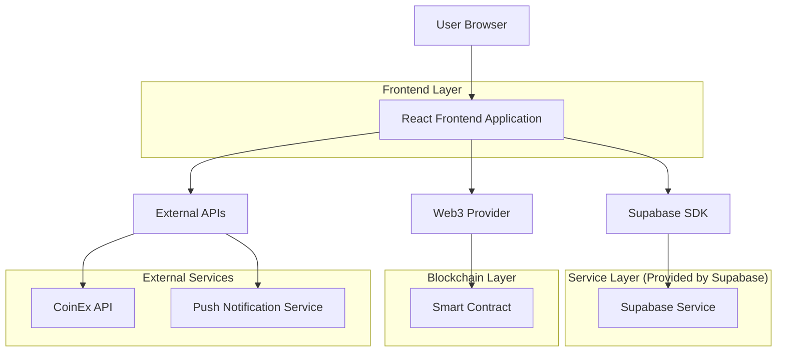
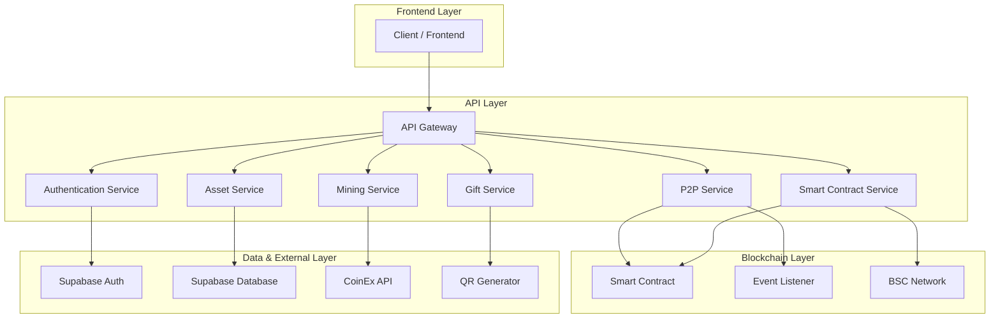
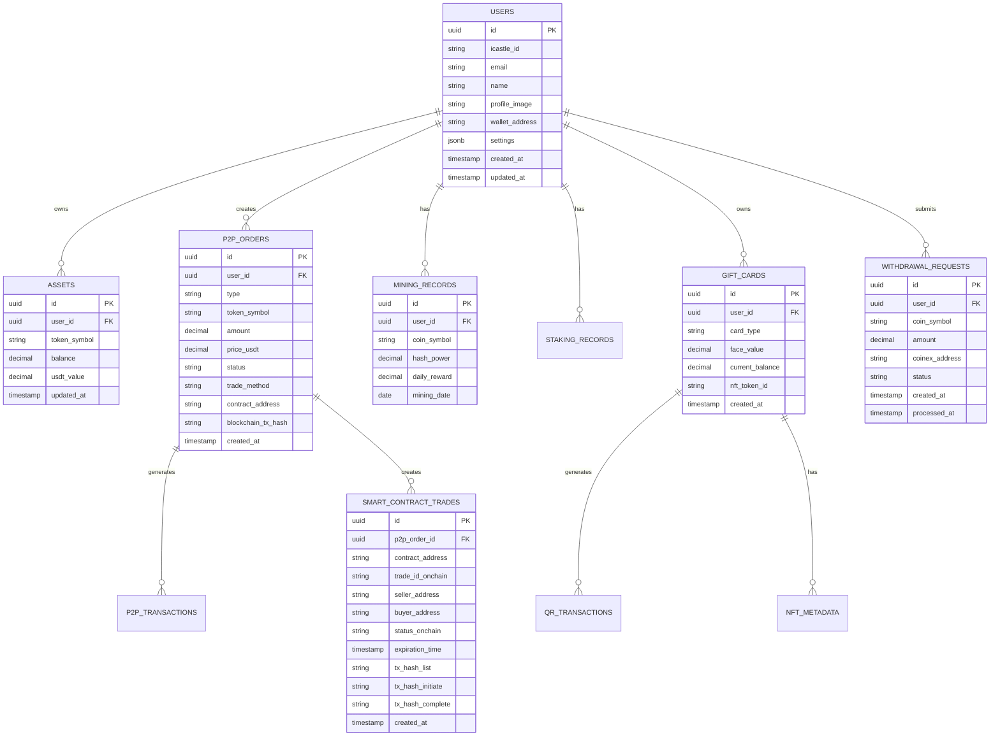

# IC Wallet 기술 아키텍처 문서

## 1. Architecture design



## 2. Technology Description

* Frontend: React\@18 + TypeScript\@5 + Vite\@5 + TailwindCSS\@3

* State Management: Zustand + React Query

* UI Components: Headless UI + Radix UI

* Web3 Integration: ethers.js\@6 + wagmi\@2

* Smart Contracts: Solidity\@0.8.19 + Hardhat + OpenZeppelin

* QR Code: qrcode.js + qr-scanner

* Animations: Framer Motion

* Backend: Supabase (Authentication, Database, Real-time)

* Push Notifications: Firebase Cloud Messaging

* Blockchain: BSC (Binance Smart Chain) + BEP-20 Tokens

## 3. Route definitions

| Route                    | Purpose                       |
| ------------------------ | ----------------------------- |
| /                        | 홈 대시보드, 전체 자산 현황 및 주요 기능 바로가기 |
| /p2p                     | P2P 마켓, 토큰 거래 게시판 및 내 거래 관리   |
| /p2p/create              | P2P 거래 게시글 작성 페이지             |
| /p2p/detail/:id          | P2P 거래 상세 및 구매 진행 페이지         |
| /mining                  | 채굴 대시보드, HASH 파워 및 채굴 현황      |
| /mining/detail/:coin     | 개별 코인 채굴 상세 내역                |
| /mining/withdraw         | 채굴 코인 출금 신청 페이지               |
| /mining/withdraw-history | 출금 신청 내역 조회 페이지               |
| /finance                 | 금융 메인, 스테이킹 상품 및 예치 현황        |
| /finance/staking/:type   | USDT/상품권 스테이킹 신청 페이지          |
| /gift                    | 기프트 스토어, 상품권 구매 및 보유 현황       |
| /gift/detail/:id         | 상품권 상세 및 QR 결제 생성             |
| /gift/purchase/:type     | 상품권 구매 페이지                    |
| /mypage                  | 마이페이지, 계정 설정 및 보안 관리          |
| /mypage/profile          | 프로필 정보 수정                     |
| /mypage/security         | 보안 설정 (앱 잠금, 알림 등)            |
| /mypage/exchange-account | 거래소 계정 관리 (CoinEx 연동)         |
| /mypage/whitelist        | 화이트리스트 주소 관리                  |
| /login                   | 로그인 페이지 (i-Castle 계정 연동)      |
| /token/:symbol           | 개별 토큰 상세 거래 내역                |

## 4. Smart Contract Architecture

### 4.1 P2P On-Chain 에스크로 스마트 컨트랙트

**개요**

BEP-20 토큰 간의 P2P 거래를 위한 완전 자동화된 On-Chain 에스크로 로직입니다. 제3자의 개입 없이 코드에 의해 신뢰가 보장되며, 모든 거래 과정은 투명하게 블록체인에 기록됩니다.

**주요 객체 (Entities)**

- Seller: 자산 판매자
- Buyer: 자산 구매자  
- Escrow Contract: 자산을 임시 보관하고 모든 거래 로직을 실행하는 주체
- BEP-20 Tokens: 거래 대상 자산 (예: ICC/ICS, USDT)

**상태 관리 (State Management)**

각 거래는 다음 4가지 상태 중 하나를 가집니다:

- `Listed`: 판매자가 자산을 에스크로에 등록하고 구매자를 기다리는 상태
- `Pending`: 구매자가 거래를 확정하고, 자산 입금을 대기하는 상태 (타임아웃 적용)
- `Completed`: 구매자가 자산을 입금하여 거래가 성공적으로 완료된 상태
- `Canceled`: 타임아웃 또는 기타 사유로 거래가 취소되어 자산이 판매자에게 반환된 상태

**핵심 함수 로직**

1. **판매 등록 `listAsset()`**
   - 호출자: Seller
   - 사전 조건: Seller는 판매할 토큰에 대해 본 Escrow Contract가 `transferFrom`을 실행할 수 있도록 미리 `approve`를 호출해야 함
   - 액션:
     - `transferFrom`을 실행하여 Seller의 지갑에서 판매할 토큰을 Contract 주소로 이동
     - 새로운 거래(Trade)를 생성하고 상태를 `Listed`로 설정
     - `TradeListed` 이벤트를 발생시켜 오프체인 서버에 알림

2. **거래 시작 `initiateTrade()`**
   - 호출자: Buyer
   - 액션:
     - 거래 상태를 `Listed`에서 `Pending`으로 변경
     - `block.timestamp + 1 hour`로 거래 만료 시간을 기록

3. **입금 및 자동 교환 `depositAndExecute()`**
   - 호출자: Buyer
   - 사전 조건: Buyer는 입금할 토큰(USDT)에 대해 Escrow Contract가 `transferFrom`을 실행할 수 있도록 미리 `approve`를 호출해야 함
   - 액션:
     - `transferFrom`을 실행하여 Buyer의 지갑에서 USDT를 Contract 주소로 이동
     - 즉시 (원자적 실행):
       - 입금된 USDT를 Seller의 지갑으로 `transfer`
       - 보관 중이던 판매 토큰(ICC/ICS)을 Buyer의 지갑으로 `transfer`
     - 거래 상태를 `Completed`로 변경하고 `TradeCompleted` 이벤트를 발생

4. **거래 취소 및 자산 회수 `reclaimAsset()`**
   - 호출자: Seller (또는 누구나)
   - 조건: 현재 시간이 기록된 거래 만료 시간을 지났을 경우에만 실행
   - 액션:
     - 에스크로에 보관 중이던 판매 토큰을 원래 Seller의 지갑으로 `transfer`
     - 거래 상태를 `Canceled`로 변경하고 `TradeCanceled` 이벤트를 발생

**보안 요구사항**

- **재진입 공격 방지(Re-entrancy Guard)**를 모든 외부 호출 함수에 적용
- 모든 함수의 시작점에서 입력값(주소, 수량 등)에 대한 유효성을 검증(`require`)
- 타임아웃 메커니즘으로 1시간 제한 적용
- 이벤트 시스템을 통한 투명한 거래 추적

**이벤트 정의**

```solidity
event TradeListed(uint256 indexed tradeId, address indexed seller, address tokenAddress, uint256 amount, uint256 pricePerToken);
event TradeInitiated(uint256 indexed tradeId, address indexed buyer, uint256 expirationTime);
event TradeCompleted(uint256 indexed tradeId, address indexed seller, address indexed buyer, uint256 amount);
event TradeCanceled(uint256 indexed tradeId, address indexed seller, uint256 amount);
```

### 4.2 NFT 상품권 스마트 컨트랙트

**개요**

상품권을 NFT로 발행하고 P2P 거래가 가능한 스마트 컨트랙트입니다. ERC-721 표준을 기반으로 하며, 상품권의 잔액 관리와 QR 코드 기반 결제 기능을 제공합니다.

**핵심 기능**

- NFT 상품권 발행 및 관리
- 잔액 추적 및 부분 사용 지원
- QR 코드 기반 결제 시스템
- P2P 거래 지원 (에스크로 연동)

## 5. API definitions

### 5.1 Core API

**사용자 인증 관련**

```
POST /api/auth/login
```

Request:

| Param Name     | Param Type | isRequired | Description    |
| -------------- | ---------- | ---------- | -------------- |
| icastle\_token | string     | true       | i-Castle 인증 토큰 |
| device\_id     | string     | true       | 기기 고유 식별자      |

Response:

| Param Name     | Param Type | Description |
| -------------- | ---------- | ----------- |
| access\_token  | string     | JWT 액세스 토큰  |
| refresh\_token | string     | 리프레시 토큰     |
| user           | object     | 사용자 정보 객체   |

**자산 조회 관련**

```
GET /api/assets/summary
```

Response:

| Param Name         | Param Type | Description   |
| ------------------ | ---------- | ------------- |
| total\_value\_usdt | number     | 총 자산 USDT 가치  |
| tokens             | array      | 보유 토큰 목록      |
| gift\_cards        | array      | 보유 상품권 NFT 목록 |

**P2P 거래 관련**

```
POST /api/p2p/orders
```

Request:

| Param Name    | Param Type | isRequired | Description     |
| ------------- | ---------- | ---------- | --------------- |
| type          | string     | true       | 'sell' 또는 'buy' |
| token\_symbol | string     | true       | 거래할 토큰 심볼       |
| amount        | number     | true       | 거래 수량           |
| price\_usdt   | number     | true       | 개당 USDT 가격      |

**채굴 관련**

```
GET /api/mining/status
```

Response:

| Param Name      | Param Type | Description     |
| --------------- | ---------- | --------------- |
| hash\_power     | number     | 총 HASH 파워       |
| daily\_rewards  | array      | 일일 채굴 보상 목록     |
| mineable\_coins | array      | 채굴 가능한 8종 코인 정보 |

**상품권 QR 생성**

```
POST /api/gift/generate-qr
```

Request:

| Param Name     | Param Type | isRequired | Description |
| -------------- | ---------- | ---------- | ----------- |
| gift\_card\_id | string     | true       | 상품권 NFT ID  |
| amount         | number     | true       | 사용할 금액      |

Response:

| Param Name      | Param Type | Description       |
| --------------- | ---------- | ----------------- |
| qr\_code        | string     | Base64 인코딩된 QR 코드 |
| expires\_at     | string     | QR 코드 만료 시간       |
| transaction\_id | string     | 거래 고유 ID          |

### 5.2 기존 P2P 기능과의 연동 방안

**하이브리드 아키텍처**

기존 오프체인 P2P 시스템과 새로운 온체인 에스크로 시스템을 병행 운영하여 사용자 선택권을 제공합니다.

**연동 전략**

1. **거래 타입 선택**
   - 사용자가 P2P 주문 생성 시 "일반 거래" 또는 "스마트 컨트랙트 거래" 선택
   - 스마트 컨트랙트 거래 선택 시 자동으로 온체인 에스크로 프로세스 진행

2. **상태 동기화**
   - 스마트 컨트랙트 이벤트를 실시간 모니터링
   - 온체인 상태 변화를 오프체인 데이터베이스에 반영
   - P2P 주문 상태를 통합 관리

3. **사용자 인터페이스 통합**
   - 기존 P2P 페이지에서 온체인/오프체인 거래를 구분하여 표시
   - 스마트 컨트랙트 거래는 "🔒 안전거래" 배지로 표시
   - 거래 진행 상황을 실시간으로 업데이트

**기술적 구현**

```typescript
// P2P 주문 생성 시 거래 타입 선택
interface P2POrderRequest {
  type: 'sell' | 'buy';
  token_symbol: string;
  amount: number;
  price_usdt: number;
  trade_method: 'offchain' | 'smart_contract'; // 새로 추가
  contract_address?: string; // 스마트 컨트랙트 주소
}

// 스마트 컨트랙트 이벤트 리스너
const listenToContractEvents = () => {
  escrowContract.on('TradeListed', (tradeId, seller, tokenAddress, amount, pricePerToken) => {
    // 오프체인 데이터베이스 업데이트
    updateP2POrderStatus(tradeId, 'listed');
  });
  
  escrowContract.on('TradeCompleted', (tradeId, seller, buyer, amount) => {
    // 거래 완료 처리
    updateP2POrderStatus(tradeId, 'completed');
    notifyUsers([seller, buyer], 'trade_completed');
  });
};
```

## 6. Server architecture diagram



## 6. Data model

### 6.1 Data model definition



### 6.2 Data Definition Language

**사용자 테이블 (users)**

```sql
-- create table
CREATE TABLE users (
    id UUID PRIMARY KEY DEFAULT gen_random_uuid(),
    icastle_id VARCHAR(100) UNIQUE NOT NULL,
    email VARCHAR(255) UNIQUE NOT NULL,
    name VARCHAR(100) NOT NULL,
    profile_image TEXT,
    wallet_address VARCHAR(42) UNIQUE,
    settings JSONB DEFAULT '{}',
    created_at TIMESTAMP WITH TIME ZONE DEFAULT NOW(),
    updated_at TIMESTAMP WITH TIME ZONE DEFAULT NOW()
);

-- create index
CREATE INDEX idx_users_icastle_id ON users(icastle_id);
CREATE INDEX idx_users_wallet_address ON users(wallet_address);

-- RLS policies
GRANT SELECT ON users TO anon;
GRANT ALL PRIVILEGES ON users TO authenticated;
```

**자산 테이블 (assets)**

```sql
-- create table
CREATE TABLE assets (
    id UUID PRIMARY KEY DEFAULT gen_random_uuid(),
    user_id UUID REFERENCES users(id) ON DELETE CASCADE,
    token_symbol VARCHAR(10) NOT NULL,
    balance DECIMAL(20, 8) DEFAULT 0,
    usdt_value DECIMAL(20, 8) DEFAULT 0,
    updated_at TIMESTAMP WITH TIME ZONE DEFAULT NOW()
);

-- create index
CREATE INDEX idx_assets_user_id ON assets(user_id);
CREATE INDEX idx_assets_token_symbol ON assets(token_symbol);
CREATE UNIQUE INDEX idx_assets_user_token ON assets(user_id, token_symbol);

-- RLS policies
GRANT SELECT ON assets TO anon;
GRANT ALL PRIVILEGES ON assets TO authenticated;
```

**P2P 주문 테이블 (p2p\_orders)**

```sql
-- create table
CREATE TABLE p2p_orders (
    id UUID PRIMARY KEY DEFAULT gen_random_uuid(),
    user_id UUID REFERENCES users(id) ON DELETE CASCADE,
    type VARCHAR(10) NOT NULL CHECK (type IN ('sell', 'buy')),
    token_symbol VARCHAR(10) NOT NULL,
    amount DECIMAL(20, 8) NOT NULL,
    price_usdt DECIMAL(20, 8) NOT NULL,
    status VARCHAR(20) DEFAULT 'active' CHECK (status IN ('active', 'trading', 'completed', 'cancelled')),
    trade_method VARCHAR(20) DEFAULT 'offchain' CHECK (trade_method IN ('offchain', 'smart_contract')),
    contract_address VARCHAR(42),
    blockchain_tx_hash VARCHAR(66),
    created_at TIMESTAMP WITH TIME ZONE DEFAULT NOW(),
    updated_at TIMESTAMP WITH TIME ZONE DEFAULT NOW()
);

-- create index
CREATE INDEX idx_p2p_orders_user_id ON p2p_orders(user_id);
CREATE INDEX idx_p2p_orders_status ON p2p_orders(status);
CREATE INDEX idx_p2p_orders_token_type ON p2p_orders(token_symbol, type);
CREATE INDEX idx_p2p_orders_trade_method ON p2p_orders(trade_method);

-- RLS policies
GRANT SELECT ON p2p_orders TO anon;
GRANT ALL PRIVILEGES ON p2p_orders TO authenticated;
```

**스마트 컨트랙트 거래 테이블 (smart\_contract\_trades)**

```sql
-- create table
CREATE TABLE smart_contract_trades (
    id UUID PRIMARY KEY DEFAULT gen_random_uuid(),
    p2p_order_id UUID REFERENCES p2p_orders(id) ON DELETE CASCADE,
    contract_address VARCHAR(42) NOT NULL,
    trade_id_onchain VARCHAR(100) NOT NULL,
    seller_address VARCHAR(42) NOT NULL,
    buyer_address VARCHAR(42),
    status_onchain VARCHAR(20) DEFAULT 'listed' CHECK (status_onchain IN ('listed', 'pending', 'completed', 'canceled')),
    expiration_time TIMESTAMP WITH TIME ZONE,
    tx_hash_list VARCHAR(66),
    tx_hash_initiate VARCHAR(66),
    tx_hash_complete VARCHAR(66),
    created_at TIMESTAMP WITH TIME ZONE DEFAULT NOW(),
    updated_at TIMESTAMP WITH TIME ZONE DEFAULT NOW()
);

-- create index
CREATE INDEX idx_smart_contract_trades_order_id ON smart_contract_trades(p2p_order_id);
CREATE INDEX idx_smart_contract_trades_contract ON smart_contract_trades(contract_address);
CREATE INDEX idx_smart_contract_trades_onchain_id ON smart_contract_trades(trade_id_onchain);
CREATE INDEX idx_smart_contract_trades_status ON smart_contract_trades(status_onchain);

-- RLS policies
GRANT SELECT ON smart_contract_trades TO anon;
GRANT ALL PRIVILEGES ON smart_contract_trades TO authenticated;
```

**채굴 기록 테이블 (mining\_records)**

```sql
-- create table
CREATE TABLE mining_records (
    id UUID PRIMARY KEY DEFAULT gen_random_uuid(),
    user_id UUID REFERENCES users(id) ON DELETE CASCADE,
    coin_symbol VARCHAR(10) NOT NULL,
    hash_power DECIMAL(20, 8) NOT NULL,
    daily_reward DECIMAL(20, 8) NOT NULL,
    mining_date DATE NOT NULL,
    created_at TIMESTAMP WITH TIME ZONE DEFAULT NOW()
);

-- create index
CREATE INDEX idx_mining_records_user_id ON mining_records(user_id);
CREATE INDEX idx_mining_records_date ON mining_records(mining_date DESC);
CREATE UNIQUE INDEX idx_mining_user_coin_date ON mining_records(user_id, coin_symbol, mining_date);

-- RLS policies
GRANT SELECT ON mining_records TO anon;
GRANT ALL PRIVILEGES ON mining_records TO authenticated;
```

**상품권 테이블 (gift\_cards)**

```sql
-- create table
CREATE TABLE gift_cards (
    id UUID PRIMARY KEY DEFAULT gen_random_uuid(),
    user_id UUID REFERENCES users(id) ON DELETE CASCADE,
    card_type VARCHAR(50) NOT NULL,
    face_value DECIMAL(12, 2) NOT NULL,
    current_balance DECIMAL(12, 2) NOT NULL,
    nft_token_id VARCHAR(100) UNIQUE,
    created_at TIMESTAMP WITH TIME ZONE DEFAULT NOW(),
    updated_at TIMESTAMP WITH TIME ZONE DEFAULT NOW()
);

-- create index
CREATE INDEX idx_gift_cards_user_id ON gift_cards(user_id);
CREATE INDEX idx_gift_cards_nft_token ON gift_cards(nft_token_id);

-- RLS policies
GRANT SELECT ON gift_cards TO anon;
GRANT ALL PRIVILEGES ON gift_cards TO authenticated;
```

**출금 요청 테이블 (withdrawal\_requests)**

```sql
-- create table
CREATE TABLE withdrawal_requests (
    id UUID PRIMARY KEY DEFAULT gen_random_uuid(),
    user_id UUID REFERENCES users(id) ON DELETE CASCADE,
    coin_symbol VARCHAR(10) NOT NULL,
    amount DECIMAL(20, 8) NOT NULL,
    coinex_address VARCHAR(100) NOT NULL,
    status VARCHAR(20) DEFAULT 'pending' CHECK (status IN ('pending', 'processing', 'completed', 'failed')),
    created_at TIMESTAMP WITH TIME ZONE DEFAULT NOW(),
    processed_at TIMESTAMP WITH TIME ZONE
);

-- create index
CREATE INDEX idx_withdrawal_requests_user_id ON withdrawal_requests(user_id);
CREATE INDEX idx_withdrawal_requests_status ON withdrawal_requests(status);
CREATE INDEX idx_withdrawal_requests_created_at ON withdrawal_requests(created_at DESC);

-- RLS policies
GRANT SELECT ON withdrawal_requests TO anon;
GRANT ALL PRIVILEGES ON withdrawal_requests TO authenticated;
```

