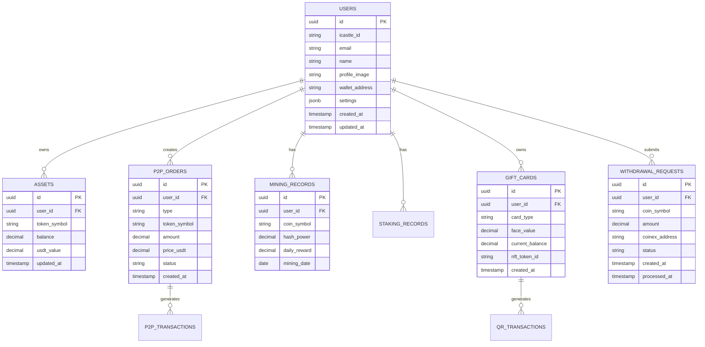

# IC Wallet 기술 아키텍처 문서

## 1. Architecture design


## 2. Technology Description

- Frontend: React@18 + TypeScript@5 + Vite@5 + TailwindCSS@3
- State Management: Zustand + React Query
- UI Components: Headless UI + Radix UI
- Web3 Integration: ethers.js@6 + wagmi@2
- QR Code: qrcode.js + qr-scanner
- Animations: Framer Motion
- Backend: Supabase (Authentication, Database, Real-time)
- Push Notifications: Firebase Cloud Messaging

## 3. Route definitions

| Route | Purpose |
|-------|---------|
| / | 홈 대시보드, 전체 자산 현황 및 주요 기능 바로가기 |
| /p2p | P2P 마켓, 토큰 거래 게시판 및 내 거래 관리 |
| /p2p/create | P2P 거래 게시글 작성 페이지 |
| /p2p/detail/:id | P2P 거래 상세 및 구매 진행 페이지 |
| /mining | 채굴 대시보드, HASH 파워 및 채굴 현황 |
| /mining/detail/:coin | 개별 코인 채굴 상세 내역 |
| /mining/withdraw | 채굴 코인 출금 신청 페이지 |
| /mining/withdraw-history | 출금 신청 내역 조회 페이지 |
| /finance | 금융 메인, 스테이킹 상품 및 예치 현황 |
| /finance/staking/:type | USDT/상품권 스테이킹 신청 페이지 |
| /gift | 기프트 스토어, 상품권 구매 및 보유 현황 |
| /gift/detail/:id | 상품권 상세 및 QR 결제 생성 |
| /gift/purchase/:type | 상품권 구매 페이지 |
| /mypage | 마이페이지, 계정 설정 및 보안 관리 |
| /mypage/profile | 프로필 정보 수정 |
| /mypage/security | 보안 설정 (앱 잠금, 알림 등) |
| /mypage/exchange-account | 거래소 계정 관리 (CoinEx 연동) |
| /mypage/whitelist | 화이트리스트 주소 관리 |
| /login | 로그인 페이지 (i-Castle 계정 연동) |
| /token/:symbol | 개별 토큰 상세 거래 내역 |

## 4. API definitions

### 4.1 Core API

**사용자 인증 관련**
```
POST /api/auth/login
```

Request:
| Param Name | Param Type | isRequired | Description |
|------------|------------|------------|-------------|
| icastle_token | string | true | i-Castle 인증 토큰 |
| device_id | string | true | 기기 고유 식별자 |

Response:
| Param Name | Param Type | Description |
|------------|------------|-------------|
| access_token | string | JWT 액세스 토큰 |
| refresh_token | string | 리프레시 토큰 |
| user | object | 사용자 정보 객체 |

**자산 조회 관련**
```
GET /api/assets/summary
```

Response:
| Param Name | Param Type | Description |
|------------|------------|-------------|
| total_value_usdt | number | 총 자산 USDT 가치 |
| tokens | array | 보유 토큰 목록 |
| gift_cards | array | 보유 상품권 NFT 목록 |

**P2P 거래 관련**
```
POST /api/p2p/orders
```

Request:
| Param Name | Param Type | isRequired | Description |
|------------|------------|------------|-------------|
| type | string | true | 'sell' 또는 'buy' |
| token_symbol | string | true | 거래할 토큰 심볼 |
| amount | number | true | 거래 수량 |
| price_usdt | number | true | 개당 USDT 가격 |

**채굴 관련**
```
GET /api/mining/status
```

Response:
| Param Name | Param Type | Description |
|------------|------------|-------------|
| hash_power | number | 총 HASH 파워 |
| daily_rewards | array | 일일 채굴 보상 목록 |
| mineable_coins | array | 채굴 가능한 8종 코인 정보 |

**상품권 QR 생성**
```
POST /api/gift/generate-qr
```

Request:
| Param Name | Param Type | isRequired | Description |
|------------|------------|------------|-------------|
| gift_card_id | string | true | 상품권 NFT ID |
| amount | number | true | 사용할 금액 |

Response:
| Param Name | Param Type | Description |
|------------|------------|-------------|
| qr_code | string | Base64 인코딩된 QR 코드 |
| expires_at | string | QR 코드 만료 시간 |
| transaction_id | string | 거래 고유 ID |

## 5. Server architecture diagram


## 6. Data model

### 6.1 Data model definition



### 6.2 Data Definition Language

**사용자 테이블 (users)**
```sql
-- create table
CREATE TABLE users (
    id UUID PRIMARY KEY DEFAULT gen_random_uuid(),
    icastle_id VARCHAR(100) UNIQUE NOT NULL,
    email VARCHAR(255) UNIQUE NOT NULL,
    name VARCHAR(100) NOT NULL,
    profile_image TEXT,
    wallet_address VARCHAR(42) UNIQUE,
    settings JSONB DEFAULT '{}',
    created_at TIMESTAMP WITH TIME ZONE DEFAULT NOW(),
    updated_at TIMESTAMP WITH TIME ZONE DEFAULT NOW()
);

-- create index
CREATE INDEX idx_users_icastle_id ON users(icastle_id);
CREATE INDEX idx_users_wallet_address ON users(wallet_address);

-- RLS policies
GRANT SELECT ON users TO anon;
GRANT ALL PRIVILEGES ON users TO authenticated;
```

**자산 테이블 (assets)**
```sql
-- create table
CREATE TABLE assets (
    id UUID PRIMARY KEY DEFAULT gen_random_uuid(),
    user_id UUID REFERENCES users(id) ON DELETE CASCADE,
    token_symbol VARCHAR(10) NOT NULL,
    balance DECIMAL(20, 8) DEFAULT 0,
    usdt_value DECIMAL(20, 8) DEFAULT 0,
    updated_at TIMESTAMP WITH TIME ZONE DEFAULT NOW()
);

-- create index
CREATE INDEX idx_assets_user_id ON assets(user_id);
CREATE INDEX idx_assets_token_symbol ON assets(token_symbol);
CREATE UNIQUE INDEX idx_assets_user_token ON assets(user_id, token_symbol);

-- RLS policies
GRANT SELECT ON assets TO anon;
GRANT ALL PRIVILEGES ON assets TO authenticated;
```

**P2P 주문 테이블 (p2p_orders)**
```sql
-- create table
CREATE TABLE p2p_orders (
    id UUID PRIMARY KEY DEFAULT gen_random_uuid(),
    user_id UUID REFERENCES users(id) ON DELETE CASCADE,
    type VARCHAR(10) NOT NULL CHECK (type IN ('sell', 'buy')),
    token_symbol VARCHAR(10) NOT NULL,
    amount DECIMAL(20, 8) NOT NULL,
    price_usdt DECIMAL(20, 8) NOT NULL,
    status VARCHAR(20) DEFAULT 'active' CHECK (status IN ('active', 'trading', 'completed', 'cancelled')),
    created_at TIMESTAMP WITH TIME ZONE DEFAULT NOW(),
    updated_at TIMESTAMP WITH TIME ZONE DEFAULT NOW()
);

-- create index
CREATE INDEX idx_p2p_orders_user_id ON p2p_orders(user_id);
CREATE INDEX idx_p2p_orders_status ON p2p_orders(status);
CREATE INDEX idx_p2p_orders_token_type ON p2p_orders(token_symbol, type);

-- RLS policies
GRANT SELECT ON p2p_orders TO anon;
GRANT ALL PRIVILEGES ON p2p_orders TO authenticated;
```

**채굴 기록 테이블 (mining_records)**
```sql
-- create table
CREATE TABLE mining_records (
    id UUID PRIMARY KEY DEFAULT gen_random_uuid(),
    user_id UUID REFERENCES users(id) ON DELETE CASCADE,
    coin_symbol VARCHAR(10) NOT NULL,
    hash_power DECIMAL(20, 8) NOT NULL,
    daily_reward DECIMAL(20, 8) NOT NULL,
    mining_date DATE NOT NULL,
    created_at TIMESTAMP WITH TIME ZONE DEFAULT NOW()
);

-- create index
CREATE INDEX idx_mining_records_user_id ON mining_records(user_id);
CREATE INDEX idx_mining_records_date ON mining_records(mining_date DESC);
CREATE UNIQUE INDEX idx_mining_user_coin_date ON mining_records(user_id, coin_symbol, mining_date);

-- RLS policies
GRANT SELECT ON mining_records TO anon;
GRANT ALL PRIVILEGES ON mining_records TO authenticated;
```

**상품권 테이블 (gift_cards)**
```sql
-- create table
CREATE TABLE gift_cards (
    id UUID PRIMARY KEY DEFAULT gen_random_uuid(),
    user_id UUID REFERENCES users(id) ON DELETE CASCADE,
    card_type VARCHAR(50) NOT NULL,
    face_value DECIMAL(12, 2) NOT NULL,
    current_balance DECIMAL(12, 2) NOT NULL,
    nft_token_id VARCHAR(100) UNIQUE,
    created_at TIMESTAMP WITH TIME ZONE DEFAULT NOW(),
    updated_at TIMESTAMP WITH TIME ZONE DEFAULT NOW()
);

-- create index
CREATE INDEX idx_gift_cards_user_id ON gift_cards(user_id);
CREATE INDEX idx_gift_cards_nft_token ON gift_cards(nft_token_id);

-- RLS policies
GRANT SELECT ON gift_cards TO anon;
GRANT ALL PRIVILEGES ON gift_cards TO authenticated;
```

**출금 요청 테이블 (withdrawal_requests)**
```sql
-- create table
CREATE TABLE withdrawal_requests (
    id UUID PRIMARY KEY DEFAULT gen_random_uuid(),
    user_id UUID REFERENCES users(id) ON DELETE CASCADE,
    coin_symbol VARCHAR(10) NOT NULL,
    amount DECIMAL(20, 8) NOT NULL,
    coinex_address VARCHAR(100) NOT NULL,
    status VARCHAR(20) DEFAULT 'pending' CHECK (status IN ('pending', 'processing', 'completed', 'failed')),
    created_at TIMESTAMP WITH TIME ZONE DEFAULT NOW(),
    processed_at TIMESTAMP WITH TIME ZONE
);

-- create index
CREATE INDEX idx_withdrawal_requests_user_id ON withdrawal_requests(user_id);
CREATE INDEX idx_withdrawal_requests_status ON withdrawal_requests(status);
CREATE INDEX idx_withdrawal_requests_created_at ON withdrawal_requests(created_at DESC);

-- RLS policies
GRANT SELECT ON withdrawal_requests TO anon;
GRANT ALL PRIVILEGES ON withdrawal_requests TO authenticated;
```