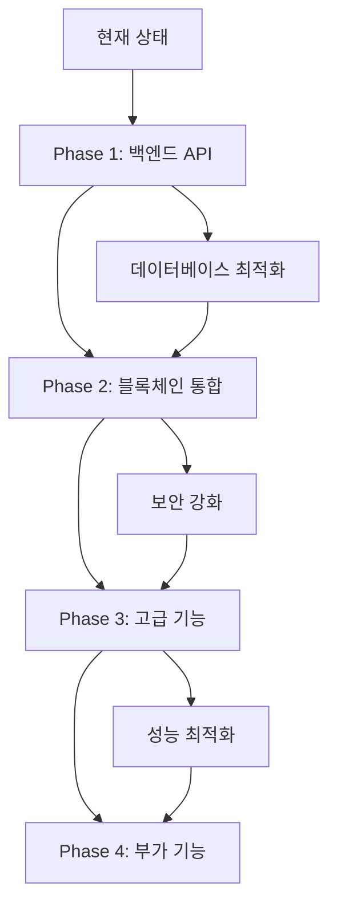

# IC Wallet 추가 개발 요구사항 분석 문서

## 1. 현재 구현 현황 분석

### 1.1 기존 구현된 기능들의 상세 리스트

#### ✅ 완료된 기능들

**인증 시스템 (Authentication)**
- ✅ OAuth 소셜 로그인 (Google, Kakao, Apple) - 백엔드 API 완료
- ✅ JWT 토큰 기반 인증 시스템
- ✅ 사용자 등록/로그인 UI 및 로직
- ✅ 보호된 라우트 구현
- ✅ 사용자 프로필 관리

**지갑 관리 (Wallet Management)**
- ✅ BNB 지갑 기본 기능 (잔고 조회, 거래 내역)
- ✅ 포인트 지갑 (채굴 코인 관리)
- ✅ NFT 지갑 기본 구조
- ✅ 지갑 개요 대시보드
- ✅ 거래 내역 조회
- ✅ QR 코드 생성 기능

**P2P 거래 (P2P Trading)**
- ✅ P2P 주문 목록 조회 UI
- ✅ 주문 생성/수정/취소 UI
- ✅ 필터링 및 검색 기능
- ✅ 사용자 평점 시스템 UI
- ✅ 거래 방법별 분류 (직거래/택배)

**채굴 시스템 (Mining)**
- ✅ 채굴 대시보드 UI
- ✅ 채굴 가능한 코인 목록
- ✅ 채굴 시작/중지 기능 UI
- ✅ 일일 수익 및 총 수익 조회
- ✅ 채굴 활동 내역

**기프트카드 시스템 (Gift Cards)**
- ✅ 기프트카드 상품 목록
- ✅ 구매 기능 UI
- ✅ 사용자 보유 기프트카드 조회
- ✅ IC Gift NFT 관리
- ✅ QR 코드 생성 및 사용

**금융 서비스 (Finance)**
- ✅ 스테이킹 카드 UI
- ✅ 대출 서비스 UI
- ✅ 금융 거래 내역 조회

#### 🔄 부분 완료된 기능들

**데이터베이스 구조**
- ✅ SQLite 기반 데이터베이스 설계
- ✅ 사용자, 지갑, 거래 테이블 구조
- ⚠️ 일부 테이블 관계 및 인덱스 최적화 필요

**백엔드 API**
- ✅ 인증 API (auth.ts)
- ✅ 지갑 API (wallet.ts) - 기본 기능만
- ❌ P2P 거래 API 미구현
- ❌ 채굴 API 미구현
- ❌ 기프트카드 API 미구현
- ❌ 금융 서비스 API 미구현

### 1.2 현재 사용 중인 기술 스택 및 아키텍처

**프론트엔드**
- React 18 + TypeScript
- Vite (빌드 도구)
- Tailwind CSS (스타일링)
- React Router (라우팅)
- Zustand (상태 관리)
- React Query (서버 상태 관리)
- Lucide React (아이콘)

**백엔드**
- Node.js + Express
- TypeScript
- SQLite (데이터베이스)
- Passport.js (OAuth 인증)
- JWT (토큰 인증)
- bcryptjs (패스워드 해싱)

**개발 환경**
- 목업 데이터 기반 프론트엔드 개발
- 백엔드 API 서버 (포트 3001)
- 프론트엔드 개발 서버 (포트 5173)

## 2. PRD v3.0 대비 Gap 분석

### 2.1 우선순위별(P0/P1/P2) 미구현 기능 분류

#### P0 (핵심 기능) - 미구현 항목

**스마트 컨트랙트 통합**
- ❌ 블록체인 네트워크 연동 (Ethereum, BSC)
- ❌ 스마트 컨트랙트 배포 및 관리
- ❌ 토큰 전송 및 수신 실제 구현
- ❌ 가스비 계산 및 최적화

**실시간 데이터 연동**
- ❌ 실시간 토큰 가격 API 연동
- ❌ 거래소 API 연동 (CoinEx 등)
- ❌ 실시간 채굴 풀 연동
- ❌ 블록체인 트랜잭션 모니터링

**보안 강화**
- ❌ 하드웨어 지갑 연동
- ❌ 다중 서명 지갑 지원
- ❌ 생체 인증 (지문, 얼굴 인식)
- ❌ 2FA (Two-Factor Authentication)

#### P1 (중요 기능) - 미구현 항목

**고급 P2P 기능**
- ❌ 에스크로 서비스 구현
- ❌ 분쟁 해결 시스템
- ❌ 자동 매칭 알고리즘
- ❌ 평판 시스템 고도화

**채굴 풀 관리**
- ❌ 실제 채굴 풀 연동
- ❌ 해시파워 분배 알고리즘
- ❌ 채굴 수익 자동 분배
- ❌ 채굴 풀 성능 모니터링

**금융 서비스 확장**
- ❌ DeFi 프로토콜 연동
- ❌ 자동 스테이킹 기능
- ❌ 수익률 최적화 알고리즘
- ❌ 리스크 관리 시스템

#### P2 (부가 기능) - 미구현 항목

**소셜 기능**
- ❌ 사용자 간 메시징
- ❌ 커뮤니티 기능
- ❌ 추천 시스템
- ❌ 소셜 트레이딩

**고급 분석 도구**
- ❌ 포트폴리오 분석
- ❌ 수익률 차트 및 통계
- ❌ 시장 분석 도구
- ❌ 알림 및 경고 시스템

### 2.2 기능별 상세 요구사항과 현재 상태 비교

| 기능 영역 | PRD v3.0 요구사항 | 현재 구현 상태 | Gap 분석 |
|-----------|-------------------|----------------|----------|
| 사용자 인증 | OAuth + 2FA + 생체인증 | OAuth만 구현 | 2FA, 생체인증 미구현 |
| 지갑 관리 | 다중 체인 + 하드웨어 지갑 | 단일 체인 목업 | 실제 블록체인 연동 필요 |
| P2P 거래 | 스마트 컨트랙트 + 에스크로 | UI만 구현 | 백엔드 로직 전체 미구현 |
| 채굴 시스템 | 실제 풀 연동 + 자동 분배 | UI + 목업 데이터 | 실제 채굴 풀 연동 필요 |
| 기프트카드 | NFT + 실제 상품 연동 | 기본 UI만 | 실제 상품 API 연동 필요 |
| 금융 서비스 | DeFi + 자동화 | 기본 UI만 | DeFi 프로토콜 연동 필요 |

## 3. 추가 개발 필요 항목

### 3.1 완전히 새로 개발해야 할 기능들

#### 백엔드 API 개발 (우선순위: 높음)
1. **P2P 거래 API**
   - 주문 생성/수정/삭제 API
   - 거래 매칭 알고리즘
   - 에스크로 서비스 로직
   - 평판 시스템 API

2. **채굴 시스템 API**
   - 채굴 풀 연동 API
   - 수익 계산 및 분배 로직
   - 해시파워 관리 API
   - 출금 처리 시스템

3. **기프트카드 API**
   - 상품 관리 API
   - 구매 처리 로직
   - NFT 발행 시스템
   - 사용 내역 관리

4. **금융 서비스 API**
   - 스테이킹 풀 관리
   - 대출 심사 시스템
   - 이자 계산 로직
   - 리스크 평가 시스템

#### 블록체인 통합 (우선순위: 높음)
1. **스마트 컨트랙트 개발**
   - ERC-20 토큰 컨트랙트
   - P2P 거래 에스크로 컨트랙트
   - 스테이킹 컨트랙트
   - NFT (ERC-721) 컨트랙트

2. **Web3 통합**
   - Web3.js/Ethers.js 연동
   - 메타마스크 연동
   - 트랜잭션 처리 로직
   - 가스비 최적화

#### 보안 시스템 (우선순위: 중간)
1. **고급 인증 시스템**
   - 2FA 구현
   - 생체 인증 연동
   - 하드웨어 지갑 지원
   - 세션 관리 강화

2. **보안 모니터링**
   - 이상 거래 탐지
   - 보안 로그 시스템
   - 침입 탐지 시스템
   - 자동 보안 알림

### 3.2 기존 기능의 확장/개선이 필요한 항목들

#### 프론트엔드 개선
1. **사용자 경험 향상**
   - 로딩 상태 개선
   - 에러 처리 강화
   - 오프라인 지원
   - 성능 최적화

2. **반응형 디자인 완성**
   - 태블릿 최적화
   - 데스크톱 레이아웃 개선
   - 접근성 향상
   - 다국어 지원

#### 데이터베이스 최적화
1. **성능 개선**
   - 인덱스 최적화
   - 쿼리 성능 튜닝
   - 캐싱 시스템 도입
   - 데이터 아카이빙

2. **확장성 준비**
   - 샤딩 전략 수립
   - 읽기 전용 복제본
   - 백업 자동화
   - 모니터링 시스템

### 3.3 API 연동이 필요한 부분들

#### 외부 서비스 연동
1. **거래소 API**
   - CoinEx API 연동
   - 실시간 가격 데이터
   - 거래 실행 API
   - 잔고 동기화

2. **결제 시스템**
   - 신용카드 결제 (Stripe/PayPal)
   - 은행 계좌 연동
   - 암호화폐 결제 게이트웨이
   - 환율 API

3. **외부 데이터 소스**
   - 코인 시세 API (CoinGecko, CoinMarketCap)
   - 뉴스 API
   - 소셜 미디어 API
   - 날씨 API (채굴 효율성)

## 4. 개발 우선순위 및 계획

### 4.1 Phase별 개발 계획

#### Phase 1: 핵심 백엔드 API 개발 (4-6주)
**목표**: 기존 프론트엔드와 연동 가능한 실제 API 구현

**개발 항목**:
1. P2P 거래 API 완성
   - 주문 CRUD API
   - 거래 매칭 로직
   - 기본 에스크로 시스템

2. 채굴 시스템 API 완성
   - 채굴 데이터 관리 API
   - 수익 계산 로직
   - 출금 처리 시스템

3. 기프트카드 API 완성
   - 상품 관리 API
   - 구매/사용 처리 로직
   - 기본 NFT 시스템

**예상 기간**: 4-6주
**의존성**: 현재 데이터베이스 구조 활용

#### Phase 2: 블록체인 기본 통합 (6-8주)
**목표**: 실제 블록체인 네트워크와의 기본 연동

**개발 항목**:
1. Web3 통합 기반 구축
   - 메타마스크 연동
   - 기본 트랜잭션 처리
   - 토큰 전송/수신

2. 스마트 컨트랙트 개발
   - ERC-20 토큰 컨트랙트
   - 기본 에스크로 컨트랙트
   - 테스트넷 배포

3. 프론트엔드 Web3 연동
   - 지갑 연결 UI
   - 트랜잭션 확인 UI
   - 가스비 표시

**예상 기간**: 6-8주
**의존성**: Phase 1 완료 후 진행

#### Phase 3: 고급 기능 및 최적화 (8-10주)
**목표**: 고급 기능 구현 및 성능 최적화

**개발 항목**:
1. 고급 P2P 기능
   - 자동 매칭 알고리즘
   - 고급 에스크로 시스템
   - 분쟁 해결 시스템

2. DeFi 통합
   - 스테이킹 프로토콜 연동
   - 수익률 최적화
   - 자동 복리 투자

3. 보안 강화
   - 2FA 구현
   - 고급 모니터링
   - 보안 감사

**예상 기간**: 8-10주
**의존성**: Phase 2 완료 후 진행

#### Phase 4: 부가 기능 및 확장 (6-8주)
**목표**: 사용자 경험 향상 및 부가 기능 구현

**개발 항목**:
1. 소셜 기능
   - 사용자 간 메시징
   - 커뮤니티 기능
   - 추천 시스템

2. 고급 분석 도구
   - 포트폴리오 분석
   - 수익률 차트
   - 시장 분석 도구

3. 모바일 앱 개발
   - React Native 포팅
   - 푸시 알림
   - 생체 인증

**예상 기간**: 6-8주
**의존성**: Phase 3 완료 후 진행

### 4.2 의존성 관계 분석



## 5. 기술적 고려사항

### 5.1 목업 데이터 vs 실제 API 연동 전략

#### 현재 목업 데이터 활용 방식
- Zustand 스토어에서 목업 데이터 생성
- 실제 API 호출 시뮬레이션
- 개발 속도 향상 및 UI/UX 검증

#### 실제 API 연동 전략
1. **점진적 마이그레이션**
   - 기능별로 순차적 API 연동
   - 목업과 실제 API 병행 운영
   - 환경 변수로 모드 전환

2. **API 인터페이스 표준화**
   - 일관된 응답 형식 정의
   - 에러 처리 표준화
   - 타입 안전성 보장

3. **테스트 전략**
   - 목업 데이터로 단위 테스트
   - 실제 API로 통합 테스트
   - E2E 테스트 자동화

### 5.2 기존 코드베이스와의 호환성 유지 방안

#### 코드 구조 보존
1. **기존 컴포넌트 구조 유지**
   - 현재 페이지 구조 그대로 활용
   - 컴포넌트 인터페이스 호환성 보장
   - 점진적 리팩토링 적용

2. **스토어 패턴 확장**
   - 기존 Zustand 스토어 구조 유지
   - 새로운 액션 및 상태 추가
   - 백워드 호환성 보장

3. **타입 정의 확장**
   - 기존 타입 정의 확장
   - 새로운 인터페이스 추가
   - 타입 안전성 강화

#### 마이그레이션 전략
1. **기능별 독립적 개발**
   - 각 기능 모듈 독립성 보장
   - 의존성 최소화
   - 롤백 가능한 구조

2. **환경 분리**
   - 개발/스테이징/프로덕션 환경 분리
   - 기능 플래그 활용
   - A/B 테스트 지원

### 5.3 새로운 기능의 모듈화 설계

#### 모듈 구조 설계
```
src/
├── modules/
│   ├── blockchain/          # 블록체인 통합 모듈
│   │   ├── contracts/       # 스마트 컨트랙트
│   │   ├── web3/           # Web3 연동
│   │   └── utils/          # 블록체인 유틸리티
│   ├── defi/               # DeFi 프로토콜 모듈
│   │   ├── staking/        # 스테이킹 기능
│   │   ├── lending/        # 대출 기능
│   │   └── yield/          # 수익률 최적화
│   ├── security/           # 보안 모듈
│   │   ├── auth/           # 고급 인증
│   │   ├── monitoring/     # 보안 모니터링
│   │   └── encryption/     # 암호화
│   └── analytics/          # 분석 모듈
│       ├── portfolio/      # 포트폴리오 분석
│       ├── market/         # 시장 분석
│       └── reporting/      # 리포팅
```

#### 모듈 간 통신 패턴
1. **이벤트 기반 아키텍처**
   - 모듈 간 느슨한 결합
   - 이벤트 버스 활용
   - 비동기 처리 지원

2. **의존성 주입**
   - 인터페이스 기반 설계
   - 테스트 용이성 향상
   - 모듈 교체 가능성

3. **상태 관리 분리**
   - 모듈별 독립적 상태 관리
   - 글로벌 상태 최소화
   - 상태 동기화 메커니즘

## 6. 검증 계획

### 6.1 기존 기능 Regression 테스트

#### 자동화된 테스트 스위트
1. **단위 테스트**
   - 기존 컴포넌트 테스트
   - 스토어 로직 테스트
   - 유틸리티 함수 테스트

2. **통합 테스트**
   - API 연동 테스트
   - 페이지 간 네비게이션 테스트
   - 사용자 플로우 테스트

3. **E2E 테스트**
   - 주요 사용자 시나리오
   - 크로스 브라우저 테스트
   - 모바일 반응형 테스트

#### 성능 테스트
1. **로딩 성능**
   - 페이지 로딩 시간 측정
   - 번들 크기 모니터링
   - 메모리 사용량 체크

2. **사용자 경험**
   - 인터랙션 응답 시간
   - 애니메이션 성능
   - 스크롤 성능

### 6.2 추가 기능 유닛 테스트

#### 새로운 기능 테스트 전략
1. **TDD 접근법**
   - 테스트 우선 개발
   - 코드 커버리지 90% 이상
   - 테스트 자동화

2. **모듈별 테스트**
   - 블록체인 모듈 테스트
   - DeFi 기능 테스트
   - 보안 기능 테스트

### 6.3 목업 데이터 기반 통합 테스트

#### 테스트 데이터 관리
1. **시나리오 기반 테스트**
   - 실제 사용 시나리오 모방
   - 엣지 케이스 포함
   - 에러 상황 시뮬레이션

2. **데이터 일관성 검증**
   - 목업 데이터 정합성
   - API 응답 형식 검증
   - 타입 안전성 확인

## 7. 결론 및 권장사항

### 7.1 개발 우선순위 권장사항

1. **즉시 시작 (Phase 1)**
   - P2P 거래 API 개발
   - 채굴 시스템 API 개발
   - 기프트카드 API 개발

2. **단기 목표 (Phase 2)**
   - 기본 블록체인 통합
   - Web3 연동 구현
   - 보안 기능 강화

3. **중장기 목표 (Phase 3-4)**
   - DeFi 프로토콜 통합
   - 고급 분석 도구
   - 모바일 앱 개발

### 7.2 리스크 관리 방안

1. **기술적 리스크**
   - 블록체인 네트워크 불안정성
   - 스마트 컨트랙트 보안 취약점
   - 확장성 문제

2. **비즈니스 리스크**
   - 규제 변화 대응
   - 시장 변동성
   - 경쟁사 대응

3. **운영 리스크**
   - 개발 일정 지연
   - 인력 부족
   - 품질 관리

### 7.3 성공 지표

1. **기술적 지표**
   - API 응답 시간 < 200ms
   - 시스템 가용성 > 99.9%
   - 코드 커버리지 > 90%

2. **비즈니스 지표**
   - 사용자 만족도 > 4.5/5
   - 거래 성공률 > 99%
   - 보안 사고 0건

이 분석 문서를 바탕으로 체계적이고 단계적인 추가 개발을 진행하여 PRD v3.0의 모든 요구사항을 충족하는 완성도 높은 IC Wallet을 구축할 수 있을 것입니다.